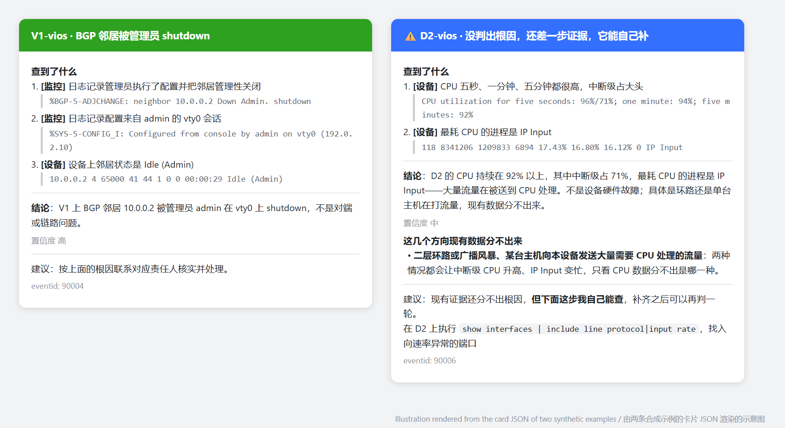
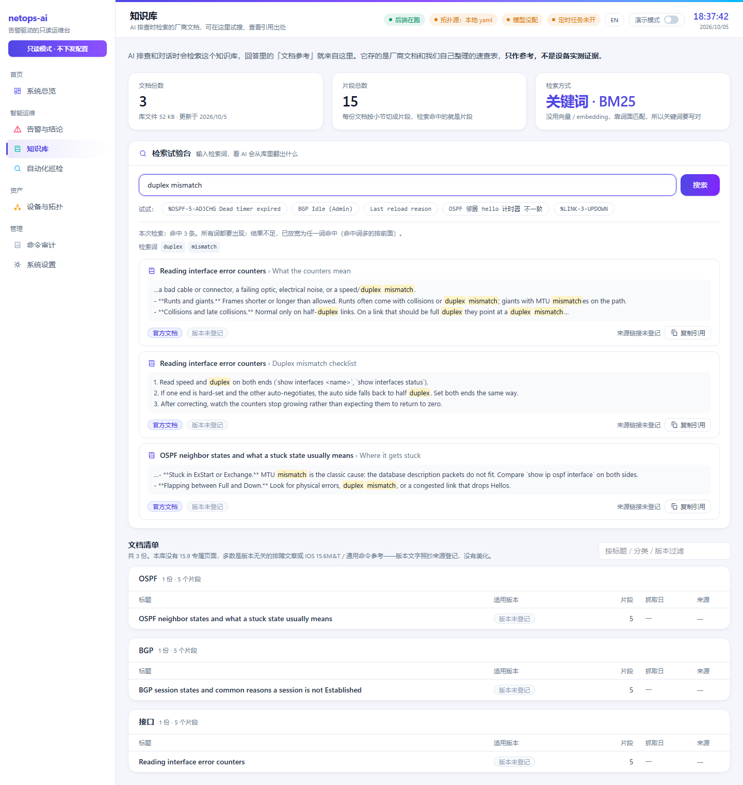
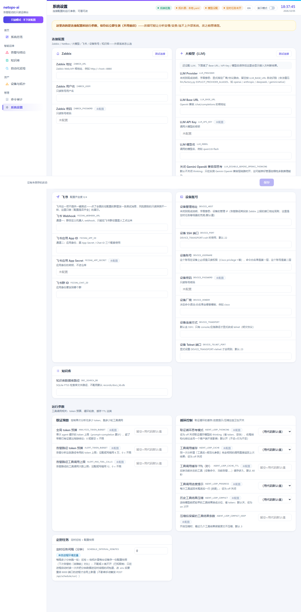

# netops-ai

**Alert-driven, read-only AI network troubleshooting.** A Zabbix alert comes in, an AI agent investigates the devices with read-only commands, and you get a root-cause conclusion that quotes the evidence it used — on a Feishu card and a web dashboard.

**告警驱动的只读 AI 网络排障。** Zabbix 告警进来，AI 用只读命令去查设备，给出根因结论并引用它依据的原文，推到飞书卡片和网页看板。

[English](#english) · [中文](#中文) · [Install / 部署](docs/INSTALL.md) · [Lab / 实验环境](docs/LAB.md) · [Architecture / 架构](docs/ARCHITECTURE.md) · [Contributing / 贡献](CONTRIBUTING.md)

<p align="center"></p>

---

# English

## What it does

1. Zabbix sends an alert to `POST /webhooks/zabbix`.
2. Related alerts are merged into one incident.
3. The agent investigates with read-only tools only: Zabbix queries, `show` commands on the devices, topology neighbors, your playbooks.
4. It writes a structured conclusion: root cause, confidence, the evidence it quoted, and — when it can't tell — what is still unknown and which command would settle it.
5. The result goes to a Feishu card and the dashboard.

**It never changes anything.** Every device command passes a whitelist in code (only full `show …` commands), and you also give it a read-only device account. A refused command is never sent.

## How it works

- **Merge.** Alerts that arrive close together wait a short window (`ALERT_WINDOW_*`) and become one incident, so a link failure with ten knock-on alerts gives one conclusion, not ten.
- **Investigate.** One tool-calling loop with a token budget, call limits, duplicate-call blocking and a no-progress stop. Playbooks (YAML) only *advise* the agent; they never execute anything.
- **Two-layer read-only guard.** Layer 1 is code: every device command is checked against a whitelist before it is sent. Layer 2 is a read-only account you create on the device. The Zabbix client has a method whitelist the same way.

<p align="center"></p>

- **Conclude.** The model fills a strict schema. For each of six hypothesis families (local action, local hardware/resource, remote/upstream, link/path quality, management plane, monitoring artifact) it must say supported, ruled out (with counter-evidence) or undetermined — and "can't tell" must say what data and which command would settle it.

## Features

- Alert pipeline: webhook, merge window, incident de-duplication, Feishu card
- Read-only device access over SSH/Telnet (Cisco IOS) behind the command whitelist; read-only Zabbix client
- Structured conclusions with a six-family hypothesis checklist and an honest "can't tell"
- Playbooks (SOP) as advice, with a linter; six examples: interface down, OSPF adjacency, BGP session, device restart, high CPU, interface errors
- Scheduled inspection: trend detectors on Zabbix history plus live read-only status checks, history, diff against the last run, Markdown/HTML export
- Command audit: every command the AI ran and every one that was refused
- Local documentation search (the index ships empty; fill it with `tools/kb_ingest.py`)
- Web dashboard in Chinese and English: overview, incidents, topology, inspection, audit, knowledge base, settings; a demo mode that masks IPs and IDs for screenshots
- Offline replay and regression tools (`tools/demo_replay.py`, `tools/run_regression.py`)

## What it looks like

Offline demo (no network, no devices, no model):

<p align="center"></p>

Dashboard:

| | |
|---|---|
| Overview<br> | Incident and conclusion<br> |
| Command audit<br> | Topology<br> |

### More of the dashboard and the card

| | |
|---|---|
| Feishu card — what lands in the chat. Left: root cause found. Right: honest "can't tell" with the next command to run<br> | Automated inspection — trend findings plus read-only status checks of every device<br> |
| Knowledge base — search your own documents; shown with the three sample notes in `examples/kb/`<br> | Settings — edit `.env` from the page; secrets are masked<br> |

The cards are rendered from the JSON of two synthetic examples (an illustration, not a screenshot of the Feishu client). `python tools/seed_demo.py` fills the dashboard with six synthetic incidents so you can click through everything without any setup.

## Deploy

Three levels; each works without the next. Full steps: [docs/INSTALL.md](docs/INSTALL.md).

```bash
git clone https://github.com/qifawu/netops-ai.git && cd netops-ai
python -m venv .venv && . .venv/bin/activate     # Windows: .venv\Scripts\activate
pip install -r requirements.txt                   # Python 3.13
```

1. **Try it offline** — `python tools/demo_replay.py` (also `python -m pytest tests -q`).
2. **Dashboard** — `cd web && npm ci && npm run build && cd ..`, then (optional) `python tools/seed_demo.py` to fill it with six synthetic incidents, then `python -m uvicorn netops_ai.api.app:app --host 127.0.0.1 --port 8000` and open http://127.0.0.1:8000.
3. **Full pipeline** — `cp env.example .env` and fill in: Zabbix (read-only user), devices (**read-only account**), an LLM endpoint, optionally Feishu; list your devices in `topology.yaml`; in Zabbix add a webhook media type that posts to `/webhooks/zabbix`.

The API and dashboard have **no login**: keep uvicorn on `127.0.0.1` and put an authenticating reverse proxy in front (nginx example in [INSTALL.md](docs/INSTALL.md#securing-the-api-and-dashboard)).

## The environment it was built and tested on

A virtual network in EVE-NG: 7 Cisco nodes in three layers (2 core and 2 aggregation IOSv, 3 access IOSv-L2), running OSPF and a BGP session, one Zabbix 7.0 server polling over SNMP and receiving traps. Faults were injected by hand on the devices (interface shutdown, OSPF neighbor loss, BGP session shutdown, reload) and the agent was checked against them. Cisco IOS only; not run in production. No device images or configs are included. Details and how to rebuild it: [docs/LAB.md](docs/LAB.md).

## Where it could go next

Directions where help is welcome; none of them is promised on a date.

- **More vendors.** Each one is a command-whitelist ruleset, a command catalog and a few playbooks. Cisco IOS is the template.
- **More playbooks.** Six ship today. A playbook is a small YAML file; [docs/PLAYBOOK-FORMAT.md](docs/PLAYBOOK-FORMAT.md) has a ten-minute guide.
- **More notification channels** next to Feishu (chat webhooks, e-mail).
- **Built-in authentication** for the dashboard and webhook, so a reverse proxy is optional.
- **Richer inspection rules** and more status checks (STP, port-channel, power and fan).

## License

Apache-2.0 — [LICENSE](LICENSE).

---

# 中文

## 它做什么

1. Zabbix 把告警 `POST` 到 `/webhooks/zabbix`。
2. 相关告警合并成一个事件。
3. agent 只用只读工具取证：查 Zabbix、在设备上敲 `show` 命令、查拓扑邻居、读你的剧本。
4. 给出结构化结论：根因、置信度、引用的证据原文；判不出来时，写清还差什么、用哪条命令能判。
5. 结果推到飞书卡片和网页看板。

**它什么都不会改。** 设备命令先过代码里的白名单（只放行写全的 `show …`），你还要给它一个只读的设备账号。被拒的命令根本不会发出去。

## 工作原理

- **合并。** 时间上靠近的告警在一个短窗口里（`ALERT_WINDOW_*`）攒起来合成一个事件，一条链路故障带出十条连带告警，只给一个结论，不是十个。
- **取证。** 一个工具循环：有 token 预算、调用次数上限、重复调用拦截、无进展就停。剧本（YAML）只给 agent **建议**，从不执行。
- **两层只读守卫。** 第一层是代码：每条设备命令发出前先过白名单；第二层是你在设备上建的只读账号。Zabbix 客户端同样有方法白名单。

<p align="center"></p>

- **结论。** 模型填一份严格的结构：六类假设（本端操作、本机硬件或资源、对端或上游、链路质量、管理面、监控采集自身问题）逐个表态，支持 / 已排除（要给反证）/ 暂时判不了；判不了的要写清还差什么数据、用哪条命令能判。

## 功能清单

- 告警流水线：webhook、合并窗口、事件去重、飞书卡片
- 通过 SSH/Telnet 只读访问设备（Cisco IOS），命令白名单在前；只读的 Zabbix 客户端
- 结构化结论：六类假设清单，判不出时老实说「判不出」
- 剧本（SOP）只做建议，带 linter；六个示例：接口 down、OSPF 邻接、BGP 会话、设备重启、CPU 高、接口错误
- 定时巡检：读 Zabbix 历史的趋势检测 + 只读登设备的实时状态检查，有历史、与上次对比、Markdown/HTML 导出
- 命令审计：AI 跑过的每条命令、被拒的每条命令
- 本地文档检索（索引随仓库是空的，用 `tools/kb_ingest.py` 灌库）
- 中英文网页看板：总览、告警与结论、拓扑、巡检、审计、知识库、设置；演示模式自动遮住 IP 和编号，方便截图
- 离线回放和回归工具（`tools/demo_replay.py`、`tools/run_regression.py`）

## 效果

离线演示（不需要网络、设备、模型）：

<p align="center"></p>

网页看板：

| | |
|---|---|
| 系统总览<br> | 告警与结论<br> |
| 命令审计<br> | 设备与拓扑<br> |

### 看板和卡片的更多页面

| | |
|---|---|
| 飞书卡片——推到群里的样子。左：找到了根因；右：老实说「判不出」并给出下一条该敲的命令<br> | 自动化巡检——趋势发现加对每台设备的只读状态检查<br> |
| 知识库——检索你自己的文档；图里是 `examples/kb/` 的三篇示例笔记<br> | 系统设置——在页面里改 `.env`，密钥掩码显示<br> |

卡片图是用两条合成示例的卡片 JSON 渲染的示意图（不是飞书客户端截图）。`python tools/seed_demo.py` 会灌入六条合成告警，不用任何配置就能把所有页面点一遍。

## 怎么部署

三个层级，互不依赖。完整步骤见 [docs/INSTALL.md](docs/INSTALL.md)。

```bash
git clone https://github.com/qifawu/netops-ai.git && cd netops-ai
python -m venv .venv && . .venv/bin/activate     # Windows：.venv\Scripts\activate
pip install -r requirements.txt                   # Python 3.13
```

1. **离线体验** —— `python tools/demo_replay.py`（也可以 `python -m pytest tests -q`）。
2. **看板** —— `cd web && npm ci && npm run build && cd ..`，（可选）`python tools/seed_demo.py` 灌入六条合成告警，再 `python -m uvicorn netops_ai.api.app:app --host 127.0.0.1 --port 8000`，打开 http://127.0.0.1:8000 。
3. **完整链路** —— `cp env.example .env` 后填写：Zabbix（只读用户）、设备（**只读账号**）、大模型接口，飞书可选；在 `topology.yaml` 里写你的设备；Zabbix 里加一个 webhook 媒介类型，POST 到 `/webhooks/zabbix`。

接口和看板**没有登录**：uvicorn 只监听 `127.0.0.1`，前面放一个带认证的反向代理（nginx 示例见 [INSTALL.md](docs/INSTALL.md#securing-the-api-and-dashboard)）。

## 开发和测试用的环境

EVE-NG 里的一套虚拟网络：三层 7 台 Cisco 节点（2 台核心 + 2 台汇聚 IOSv，3 台接入 IOSv-L2），跑 OSPF 和一条 BGP 会话；一台 Zabbix 7.0 用 SNMP 轮询并接收 trap。故障是在设备上手工制造的（接口 shutdown、OSPF 邻居丢失、BGP 会话 shutdown、reload），再检查 agent 的结论。仅支持 Cisco IOS，没有在生产网络跑过。仓库不含设备镜像和配置。详情和自己怎么搭一个：[docs/LAB.md](docs/LAB.md)。

## 接下来可能的方向

欢迎一起做的方向，都不承诺时间。

- **更多厂商。** 每个厂商是一套命令白名单规则、一份命令目录和几个剧本，Cisco IOS 就是模板。
- **更多剧本。** 现在带 6 个。剧本是一个小 YAML，[docs/PLAYBOOK-FORMAT.md](docs/PLAYBOOK-FORMAT.md) 里有十分钟上手指南。
- **飞书之外的通知渠道**（群聊 webhook、邮件）。
- **内置登录**，让反向代理变成可选。
- **更丰富的巡检规则**和状态检查（STP、端口聚合、电源风扇）。

## 许可证

Apache-2.0，见 [LICENSE](LICENSE)。
