# netops-ai

**Alert-driven, read-only AI network troubleshooting — with evidence you can check.**

A Zabbix alert comes in → an AI agent investigates with **read-only** tools → it writes a **structured root-cause conclusion** that quotes the evidence it relied on → the result lands on a Feishu card and a web dashboard. The evidence-checking code (does each quote really appear in the raw data?) ships with the project and runs in offline replay and regression; the live pipeline does not run it.

**告警驱动的只读 AI 网络排障，结论带原文证据。** Zabbix 告警进来 → AI 用**只读**工具取证 → 给出**结构化根因结论**，并引用它依据的原文 → 结果推到飞书卡片和网页看板。「引文是否真的出现在原始数据里」的核对代码随项目一起提供，在离线回放和回归里运行；在线流水线不跑它。

[English](#english) · [中文](#中文) · [Install / 安装](docs/INSTALL.md) · [Architecture / 架构](docs/ARCHITECTURE.md) · [Playbooks / 剧本](docs/PLAYBOOK-FORMAT.md) · [Contributing / 贡献](CONTRIBUTING.md)

<p align="center">
  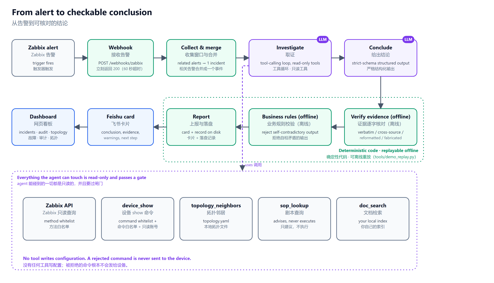
</p>

> **Status / 状态**: early-stage, lab-validated (EVE-NG, Cisco IOSv / IOS-L2, Zabbix 7.0). Cisco IOS only. Not run in a production network — read [the safety model](#safety-model-honestly) before pointing it at anything real. 早期阶段，在 EVE-NG 实验室验证过，仅支持 Cisco IOS，没有在生产网络跑过。

---

# English

## Contents

[Why](#why-this-exists) · [Try it in one minute](#try-it-in-one-minute) · [How it works](#how-it-works) · [The read-only guard](#the-two-layer-read-only-guard) · [Evidence verification](#evidence-must-be-verbatim) · [Dashboard tour](#dashboard-tour) · [Features](#features) · [Quick start](#quick-start) · [Repository layout](#repository-layout) · [Safety model](#safety-model-honestly) · [FAQ](#faq) · [License](#license)

## Why this exists

Most "AI for NetOps" demos let a model run commands and write a confident paragraph. Two things go wrong in practice: the model may touch the device, and the paragraph may quote evidence that was never there. This project is built around refusing both:

1. **It cannot change anything.** There is no code path that writes configuration. Device access is guarded twice: an in-code command whitelist (only full `show …` commands, no abbreviations, no pipes to anything but `include/exclude/begin/section/count`, no shell metacharacters) **and** a read-only account on the device. Either layer alone is not enough.
2. **Evidence must be quotable.** The model must attach to each claim the exact text it saw. `netops_ai/analysis/verify.py` can look that text up in the raw Zabbix / device output and grade it `verbatim`, `cross_source`, `reformatted` or `fabricated` — used by the offline replay and regression tools (see [the note below](#evidence-must-be-verbatim)).
3. **"I can't tell" is a valid answer.** The output schema forces the model to state, for each of six hypothesis families (local action, local hardware/resource, remote/upstream, link/path quality, management plane/reachability, monitoring/collection artifact), whether it is supported, ruled out (with counter-evidence) or undetermined — and to say what data and which command would settle the undetermined ones. Business rules (opt-in, see above) reject self-contradictory output (e.g. `confidence: high` with unresolved hypotheses).

## Try it in one minute

No network, no devices, no model, no credentials:

```bash
git clone https://github.com/qifawu/netops-ai.git && cd netops-ai
python -m venv .venv && . .venv/bin/activate        # Windows: .venv\Scripts\activate
pip install -r requirements.txt                      # Python 3.13
python tools/demo_replay.py
```

<p align="center">
  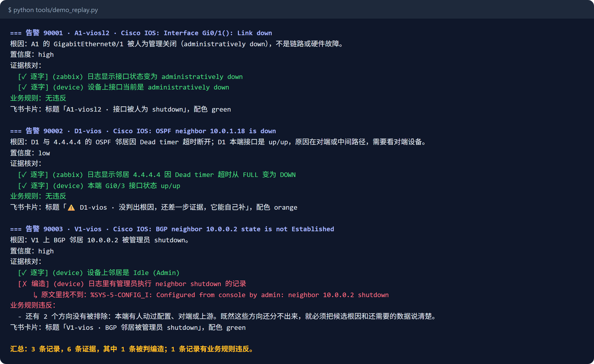
</p>

This replays three **synthetic** alert records through the same verification, business-rule and card-rendering code the live pipeline uses. Record 1 is clean; record 2 honestly says "could not determine" (the card turns orange); record 3 contains a deliberately fabricated quote, which is flagged `✗ fabricated`, and a confidence/hypothesis contradiction. Add `--card` to print the Feishu card JSON. To see them in the dashboard, copy the examples into `records/` (named `alert-<eventid>.json`, see [Quick start](#quick-start)).

## How it works

1. **Webhook.** Zabbix posts the alert to `POST /webhooks/zabbix`; the endpoint answers `200` immediately (Zabbix webhooks time out at 60 s) and hands the work to a background task.
2. **Collect & merge.** Alerts that arrive close together are held for a short window (`ALERT_WINDOW_*` in `.env`) and merged into **one incident** so a link failure with ten consequence alerts produces one conclusion, not ten.
3. **Investigate.** One tool-calling loop with a token budget, call limits, duplicate-call interception and a no-progress abort. The agent chooses which read-only tools to call — Zabbix queries, `show` commands through the whitelist, topology neighbors, SOP lookup, local documentation search.
4. **Conclude.** The model must fill a strict JSON schema (root cause, headline, confidence, evidence items, six-family hypothesis checklist, unresolved candidates, per-alert roles).
5. **Report.** A Feishu card and a record on disk that the dashboard reads.


Evidence checking (`verify.py`) and the business rules are plain deterministic code that runs on saved records (offline replay, regression, tests), not in this live path. Details: [docs/ARCHITECTURE.md](docs/ARCHITECTURE.md).

## The two-layer read-only guard

<p align="center">
  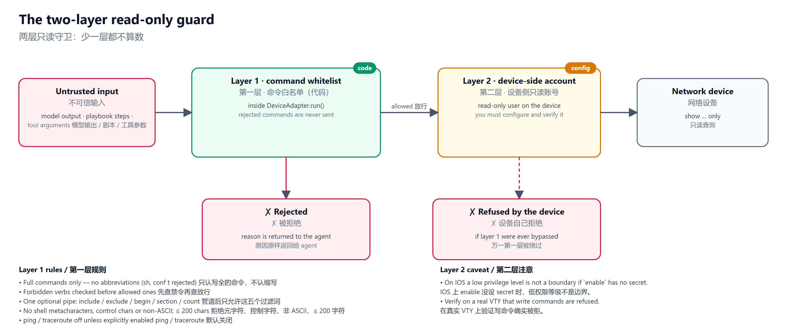
</p>

Layer 1 is code (`netops_ai/devices/whitelist.py`, evaluated inside `DeviceAdapter.run()` so a rejected command is never sent); layer 2 is a read-only account **you** configure on the device. The Zabbix client has the same shape: every API call goes through a method whitelist first. On IOS, a low privilege level is *not* a boundary if `enable` has no secret — verify over a real VTY session that write commands are refused.

## Evidence must be verbatim

<p align="center">
  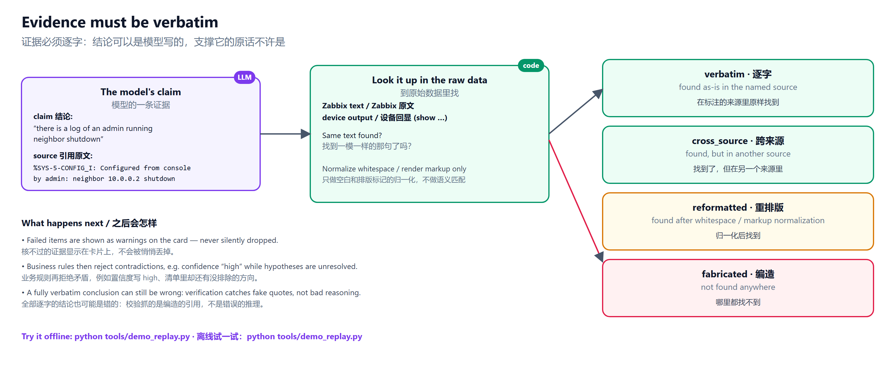
</p>

The grades are `verbatim` (found as-is in the named source), `cross_source` (found, but in the other source), `reformatted` (found after whitespace/markup normalization) and `fabricated` (not found). **This check is not part of the live alert pipeline:** on real devices it produced too many false alarms — models often join several separate lines into one quote (each line is real, the joined text is not contiguous). It is kept for offline replay, regression and the tests. Verification catches fake quotes, **not** bad reasoning: a conclusion can be fully verbatim-backed and still wrong, so treat the output as a prioritized lead, not a verdict.

## Dashboard tour

The React dashboard (`web/`) reads only the JSON API. Screenshots below use the three synthetic records and the sample topology; the interface switches between Chinese and English.

| | |
|---|---|
| **Overview** — how many incidents were handled, how fast, how many honestly escalated to a human, how many commands the whitelist blocked<br>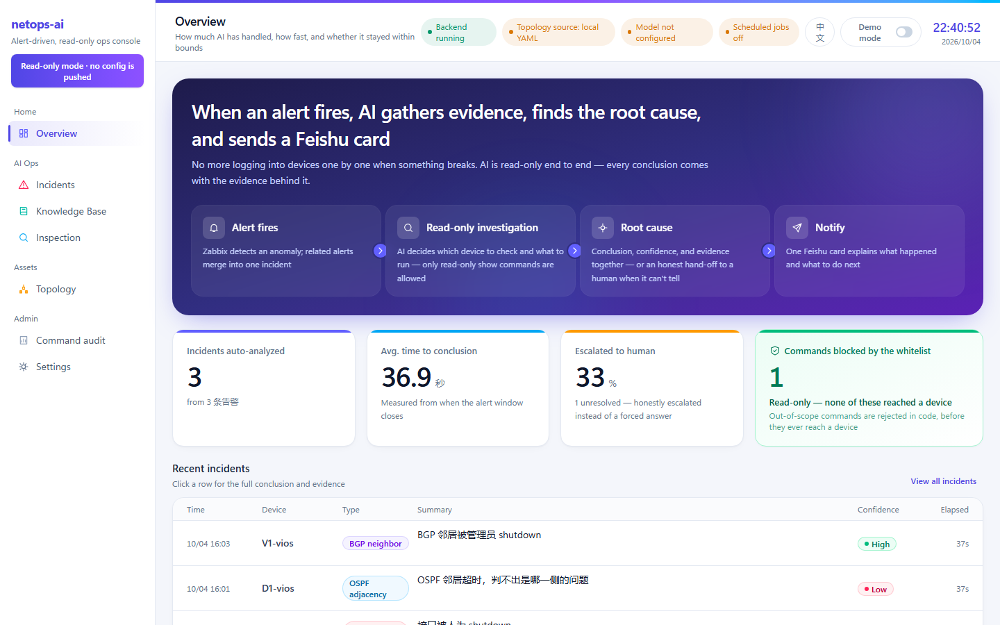 | **Incident & conclusion** — root cause, confidence, the verbatim evidence, the six-hypothesis checklist, the investigation trace<br>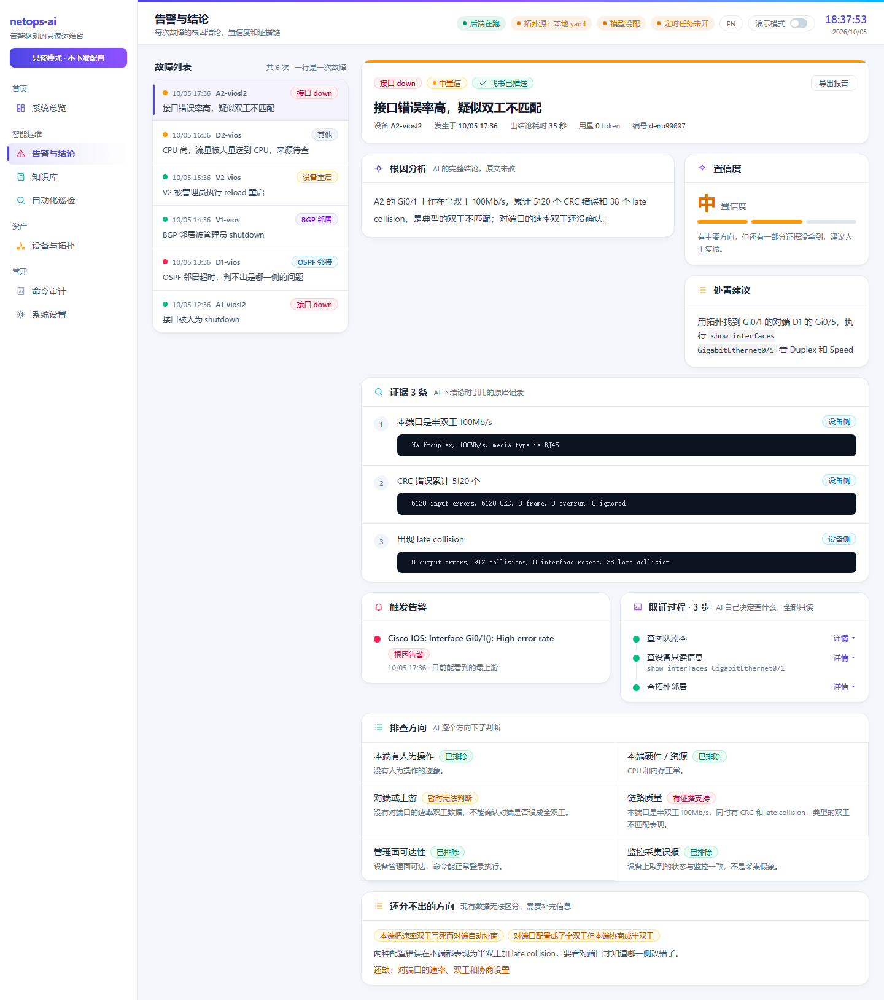 |
| **Command audit** — every command the AI ran, per device, and every command that was refused (note the blocked `clear ip bgp`)<br>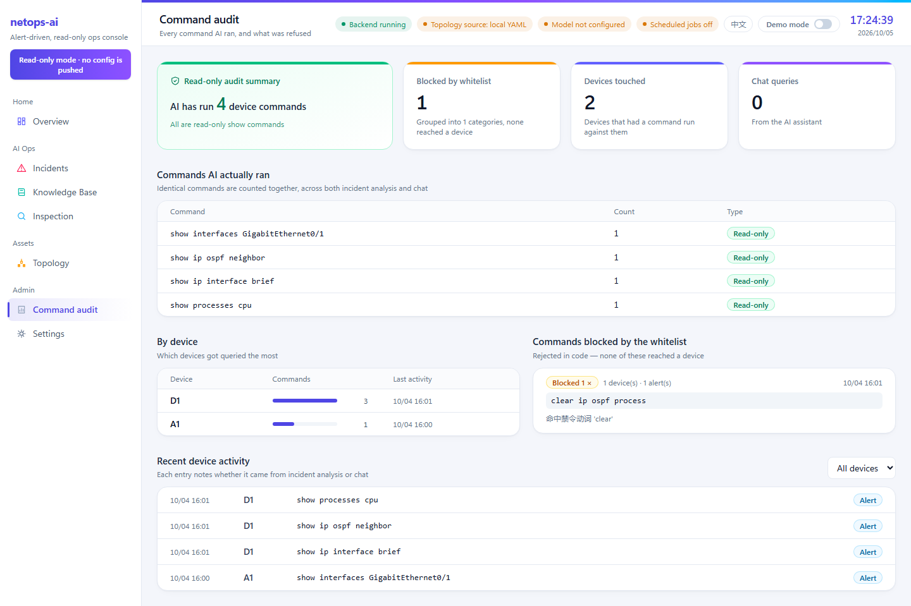 | **Devices & topology** — layered topology from `topology.yaml`, recent faults overlaid, single-uplink devices highlighted<br>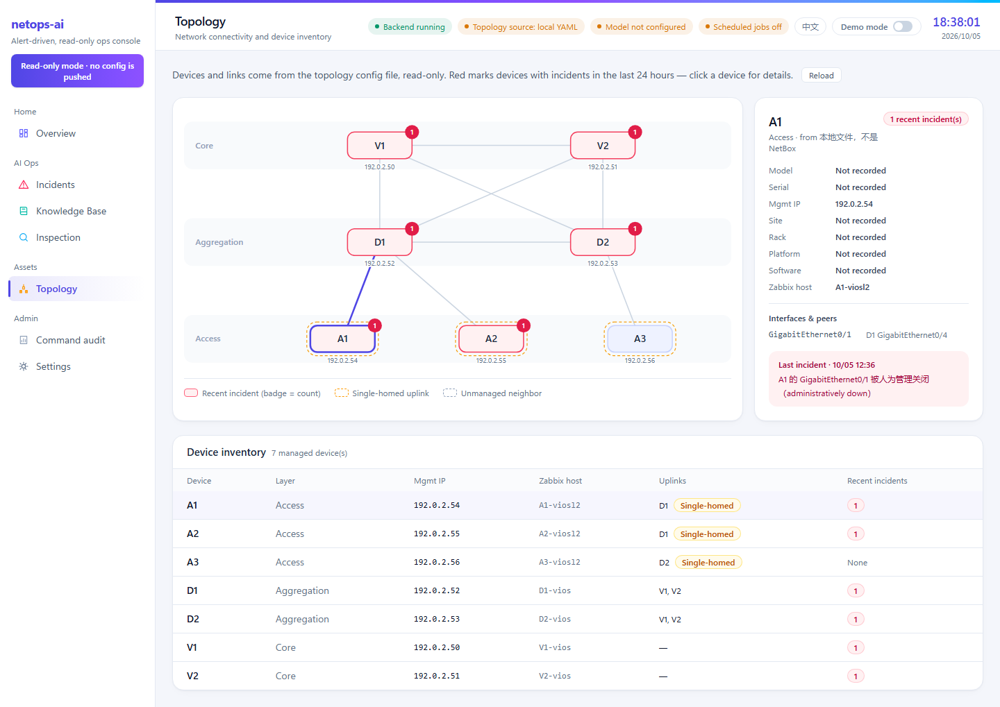 |

Chinese interface: [overview](docs/images/ui-overview.png), [command audit](docs/images/ui-audit.png), [topology](docs/images/ui-topology.png).

## Features

- **Alert pipeline** — webhook, merge window, incident de-duplication, investigation, structured conclusion, Feishu card.
- **Read-only device access** — SSH and Telnet adapters behind the command whitelist; Zabbix API behind a method whitelist.
- **Checkable conclusions** — evidence quotes that can be graded against the raw data (offline replay and regression), six-family hypothesis checklist, "can't tell" with a concrete next step.
- **Playbooks (SOP)** — YAML decision trees that *advise* the agent (they never execute); a linter checks every step uses a real read-only tool and a whitelisted command. Three examples included: `interface-link-down`, `ospf-adjacency`, `bgp-session` ([format](docs/PLAYBOOK-FORMAT.md)).
- **Inspection before anything alerts** — trend detectors on Zabbix history (sustained drift, periodic spikes, self-healing flaps) plus read-only live status checks (interface state, OSPF/BGP neighbors, error-counter growth) with the device's own output as evidence; optional AI advice with verified citations; history, diff against the last run, Markdown/HTML export.
- **Command audit** — every command and every refusal, per device.
- **Local documentation search** — BM25 over your own documents (SQLite FTS5). The index ships **empty**; ingest what you are licensed to use with `tools/kb_ingest.py`.
- **Dashboard & settings** — overview, incidents, topology, inspection, audit, knowledge base, a settings page that edits `.env` (secrets are masked and never echoed), demo mode that masks IPs/IDs for screenshots.
- **Offline replay & regression tooling** — `tools/demo_replay.py`, `tools/run_regression.py`, `tools/replay_analysis.py`, `tools/rule_hit_report.py`.

## Quick start

| Level | What you get | Needs | Guide |
|---|---|---|---|
| 1 | Tests + offline replay | Python 3.13 | [docs/INSTALL.md §1](docs/INSTALL.md) |
| 2 | Dashboard with sample records | + Node.js 20 | [§2](docs/INSTALL.md) |
| 3 | Full pipeline | + Zabbix 7.0, read-only device account, an LLM endpoint | [§3](docs/INSTALL.md) |

To see the sample records in the dashboard:

```bash
mkdir -p records
for f in examples/alerts/*.json; do cp "$f" "records/alert-$(python -c "import json,sys;print(json.load(open(sys.argv[1],encoding='utf-8'))['eventid'])" "$f").json"; done
cd web && npm ci && npm run build && cd ..
python -m uvicorn netops_ai.api.app:app --host 127.0.0.1 --port 8000      # open http://127.0.0.1:8000
```

## Repository layout

| Path | What it is |
|---|---|
| `netops_ai/devices/` | SSH / Telnet adapters and the command **whitelist** — the first read-only layer |
| `netops_ai/zabbix/` | Read-only Zabbix client (method whitelist) and the `zbx-cli` definitions |
| `netops_ai/graph/` | The tool-calling loop (budgets, de-dup, caching) and the read-only tool registry |
| `netops_ai/analysis/` | Output schema, evidence verification, business rules, timeline builder |
| `netops_ai/api/` | FastAPI app: webhook, alert pipeline, dashboard API, settings, scheduler |
| `netops_ai/incident/` | Merging correlated alerts into one incident |
| `netops_ai/feishu/` | Feishu (Lark) card rendering and senders |
| `netops_ai/inspection/` | Trend and status inspection, AI advice, history, export |
| `netops_ai/playbooks/`, `playbooks/` | Playbook engine, lookup tool, linter, Cisco IOS command catalog; the three examples |
| `netops_ai/docs_kb/` | Local documentation search |
| `web/` | The dashboard (Vite + React + TypeScript) |
| `tools/` | Replay demo, regression runner, rule/evidence reports, playbook lint, KB ingest |
| `deploy/` | Zabbix via docker compose; SNMP-trap plumbing scripts for a **lab** (they write device/guest config — read first) |
| `examples/`, `labs/` | Synthetic alert records; a few sanitized device captures |
| `tests/` | The test suite — no live devices, Zabbix or model required |

## Safety model, honestly

- **Read-only is enforced twice, but it is only as good as your device account.** The whitelist is code; the device-side account is configuration you must get right and verify.
- **The model is untrusted input.** Playbooks, model output and tool arguments all pass the whitelist; the whitelist never bends to them.
- **Verification catches fabricated quotes, not wrong reasoning — and it does not run in the live pipeline** (see above).
- **No authentication** on the webhook or the dashboard in this edition. Run them on a trusted network or behind an authenticating reverse proxy.
- **Failed analyses are recorded, not retried.** If the LLM endpoint is down, the alert gets a record with `status: analysis_failed`.
- Cisco IOS only; lab-validated; the sample topology and records are synthetic.

## FAQ

**Can it fix the problem for me?** No, by design. It reads, explains and tells you the next command to run.
**Which models work?** Anything LangChain can drive with tool calling and strict JSON schema: OpenAI-compatible endpoints, Gemini, Anthropic. Run `python tools/llm_doctor.py` to check a transport.
**Does it support other vendors (Juniper, Arista, …)?** Not in this release. Adding a vendor means a whitelist ruleset, a command catalog and playbooks — deliberately explicit, not automatic.
**Why a synthetic demo instead of real captures?** Real alerts contain real hostnames and addresses. The synthetic records have the same shape and run through the same code.
**Where are the conversational assistant, multi-user accounts, NetBox integration and an SOP authoring UI?** Not part of this repository.

## License

Apache License 2.0 — see [LICENSE](LICENSE) and [NOTICE](NOTICE). Contributions welcome: [CONTRIBUTING.md](CONTRIBUTING.md).

---

# 中文

## 目录

[为什么做](#为什么做) · [一分钟体验](#一分钟体验) · [工作原理](#工作原理) · [两层只读守卫](#两层只读守卫) · [证据必须逐字](#证据必须逐字) · [看板巡礼](#看板巡礼) · [功能](#功能) · [快速开始](#快速开始) · [仓库结构](#仓库结构) · [安全模型](#安全模型老实说) · [常见问题](#常见问题) · [许可证](#许可证)

## 为什么做

很多「AI 运维」演示是让模型登设备跑命令，再写一段笃定的结论。实际会出两个问题：模型可能动设备；结论里引的「证据」可能根本不存在。本项目围绕**拒绝这两件事**设计：

1. **它什么都改不了。** 代码里没有任何写配置的路径。设备访问有两层守卫：代码里的命令白名单（只放行写全的 `show …` 命令，不认缩写，管道后只允许 `include/exclude/begin/section/count`，拒绝一切 shell 元字符）**加上**设备侧的只读账号。单靠任何一层都不够。
2. **证据必须可引用。** 模型给每条结论附上它看到的原文，`netops_ai/analysis/verify.py` 可以去 Zabbix / 设备原始输出里核对，分 `verbatim`（逐字）、`cross_source`（跨来源）、`reformatted`（重排版）、`fabricated`（编造）四级——供离线回放和回归工具使用，见[下文](#证据必须逐字)。
3. **「判不出」是合法答案。** 输出结构强制模型对六类假设（本端有人动过配置、本机硬件或资源、对端或上游、链路或路径质量、管理面或可达性、监控采集自身问题）逐个表态：有证据支持 / 已排除（必须给反证）/ 暂时无法判断，并说明还差什么数据、用什么命令去拿。业务规则（默认关闭，见下）会拒绝自相矛盾的输出（例如置信度写 high、清单里却还有没排除的方向）。

## 一分钟体验

不连网络、不连设备、不调模型、不需要任何凭据：

```bash
git clone https://github.com/qifawu/netops-ai.git && cd netops-ai
python -m venv .venv && . .venv/bin/activate        # Windows：.venv\Scripts\activate
pip install -r requirements.txt                      # Python 3.13
python tools/demo_replay.py
```

它把三条**合成**的告警记录，送进线上同一份「证据核对 → 业务规则 → 飞书卡片」代码（输出截图见上方英文部分）：第 1 条干净；第 2 条老实承认「判不出」（卡片是橙色）；第 3 条里有一条故意编造的引用，被标成 `✗ 编造`，还有一处置信度和假设清单的矛盾。加 `--card` 打印飞书卡片 JSON。想在看板里看到这些记录，把 `examples/alerts/` 下的文件复制到 `records/`，命名成 `alert-<eventid>.json` 即可。

## 工作原理

1. **接收。** Zabbix 把告警 `POST` 到 `/webhooks/zabbix`，接口立刻回 `200`（Zabbix webhook 60 秒超时），工作交给后台任务。
2. **收集与合并。** 时间上靠近的告警会在一个短窗口内（`.env` 里的 `ALERT_WINDOW_*`）攒起来合并成**一个事件**——一条链路故障带出十条连带告警，只产出一个结论，不是十个。
3. **取证。** 一个工具循环：有 token 预算、调用次数上限、重复调用拦截和无进展中止。agent 自己决定调哪些只读工具——Zabbix 查询、过白名单的 `show` 命令、拓扑邻居、剧本查询、本地文档检索。
4. **结论。** 模型必须填一份严格的 JSON schema（根因、短标题、置信度、证据、六类假设清单、分不开的候选、每条告警的角色）。
5. **上报。** 飞书卡片和一份落盘记录，看板读这份记录。


证据核对（`verify.py`）和业务规则是确定性代码，对已保存的记录跑（离线回放、回归、测试），**不在**这条在线链路里。详见 [docs/ARCHITECTURE.md](docs/ARCHITECTURE.md)。

## 两层只读守卫

图见上方英文部分（[guard.png](docs/images/guard.png)）。第一层是代码（`netops_ai/devices/whitelist.py`，在 `DeviceAdapter.run()` 里判断，被拒的命令根本不会发出）；第二层是**你**在设备上配的只读账号。Zabbix 客户端同样先过方法白名单。IOS 上 `enable` 没设 secret 时低权限等级不是边界——请在真实 VTY 会话里验证写命令确实被拒。

## 证据必须逐字

图见上方英文部分（[evidence.png](docs/images/evidence.png)）。四个等级：`verbatim`（在标注的来源里原样找到）、`cross_source`（找到了，但在另一个来源里）、`reformatted`（归一化空白/排版后找到）、`fabricated`（哪里都找不到）。**这项核对不在在线告警流水线里：** 真机上误报偏多——模型常把几行不相连的原文拼成一条引用（每行都真，拼起来整段不连续）。它保留给离线回放、回归和测试使用。校验抓的是编造的引用，**抓不了**错误的推理：全部逐字的结论也可能是错的，把输出当成有优先级的线索，不是裁决。

## 看板巡礼

React 看板（`web/`）只读 JSON 接口。上方截图用的是三条合成记录和示例拓扑；界面支持中英文切换。

| | |
|---|---|
| **系统总览** — 处理了多少故障、多快、多少次老实转人工、白名单拦下多少条命令<br>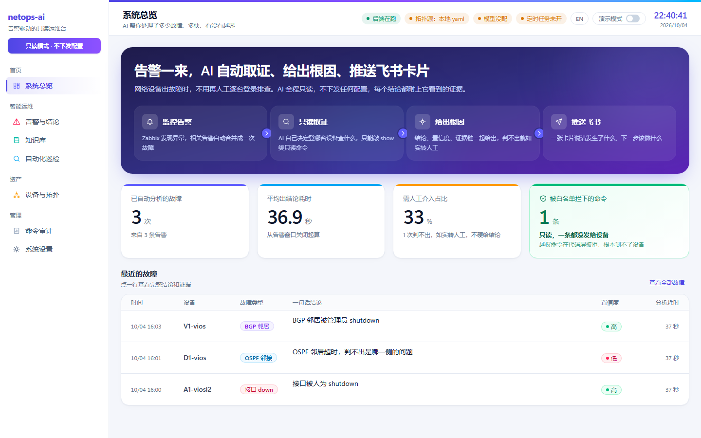 | **告警与结论** — 根因、置信度、逐字证据、六类假设清单、取证过程<br> |
| **命令审计** — AI 执行过的每条命令（按设备）和每条被拒的命令（注意被拦下的 `clear ip bgp`）<br>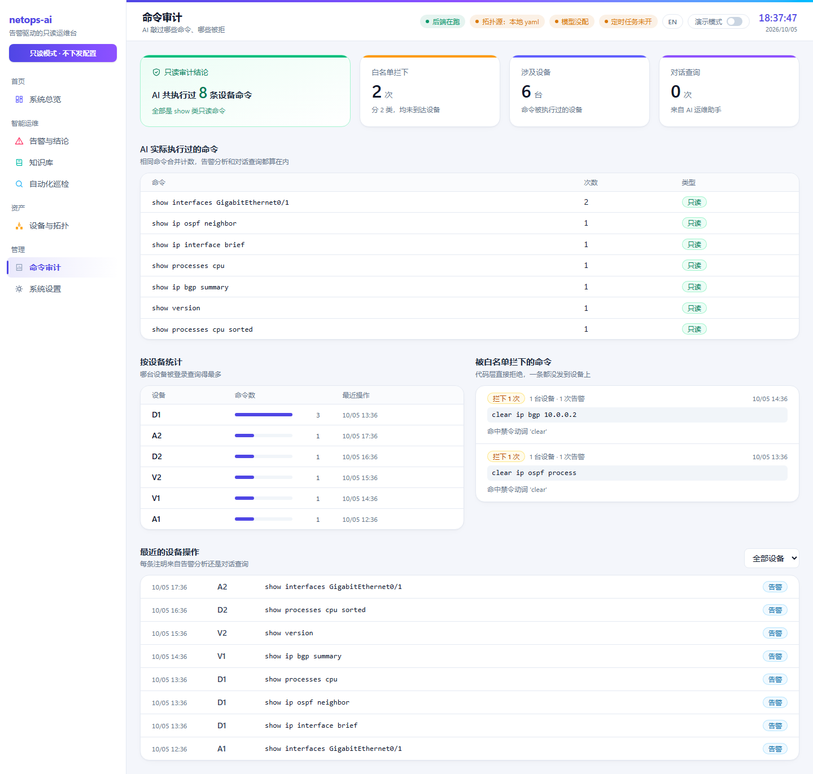 | **设备与拓扑** — 按层画的拓扑（来自 `topology.yaml`），叠加近期故障，标出单上联设备<br>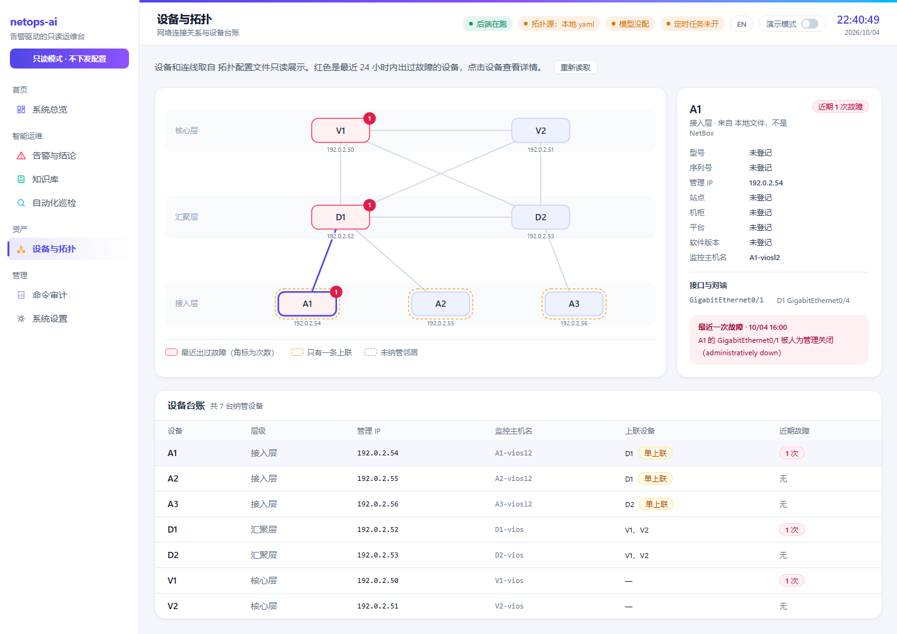 |

## 功能

- **告警流水线** — webhook、合并窗口、事件去重、取证、结构化结论、飞书卡片。
- **只读设备访问** — SSH / Telnet 适配器在命令白名单之后；Zabbix API 在方法白名单之后。
- **可核对的结论** — 证据引文可以对照原始数据分级（离线回放和回归）、六类假设清单、「判不出」时给出具体的下一步。
- **剧本（SOP）** — YAML 决策树，只给 agent **建议**（从不执行）；linter 检查每一步用的是真实的只读工具和过白名单的命令。附三个示例：`interface-link-down`、`ospf-adjacency`、`bgp-session`（[格式规范](docs/PLAYBOOK-FORMAT.md)）。
- **告警之前的巡检** — 趋势检测（持续单向变化、周期性冲高、反复抖动又自愈，读 Zabbix 历史）+ 只读登设备的状态检查（接口状态、OSPF/BGP 邻居、错误计数增长，证据是设备原话）；可选的 AI 处置建议（引文同样逐字核对）；历史、与上次对比、Markdown/HTML 导出。
- **命令审计** — 每条命令、每次拒绝，按设备列出。
- **本地文档检索** — 对你自己的文档做 BM25（SQLite FTS5）。索引随仓库**是空的**，用 `tools/kb_ingest.py` 灌你有权使用的文档。
- **看板与设置** — 总览、告警与结论、拓扑、巡检、审计、知识库；设置页直接改 `.env`（密钥掩码、永不回显）；演示模式给截图用，自动遮住 IP 和编号。
- **离线回放与回归工具** — `tools/demo_replay.py`、`tools/run_regression.py`、`tools/replay_analysis.py`、`tools/rule_hit_report.py`。

## 快速开始

| 层级 | 得到什么 | 需要 | 指南 |
|---|---|---|---|
| 1 | 测试 + 离线回放 | Python 3.13 | [docs/INSTALL.md §1](docs/INSTALL.md) |
| 2 | 带示例记录的看板 | + Node.js 20 | [§2](docs/INSTALL.md) |
| 3 | 完整流水线 | + Zabbix 7.0、设备只读账号、一个大模型接口 | [§3](docs/INSTALL.md) |

## 仓库结构

| 路径 | 是什么 |
|---|---|
| `netops_ai/devices/` | SSH / Telnet 适配器和命令**白名单**——第一层只读 |
| `netops_ai/zabbix/` | 只读 Zabbix 客户端（方法白名单）和 `zbx-cli` 定义 |
| `netops_ai/graph/` | 工具循环（预算、去重、缓存）和只读工具注册表 |
| `netops_ai/analysis/` | 输出 schema、证据核对、业务规则、时间线 |
| `netops_ai/api/` | FastAPI：webhook、告警流水线、看板接口、设置、定时任务 |
| `netops_ai/incident/` | 把相关告警合并成一个事件 |
| `netops_ai/feishu/` | 飞书卡片渲染和发送 |
| `netops_ai/inspection/` | 趋势与状态巡检、AI 建议、历史、导出 |
| `netops_ai/playbooks/`、`playbooks/` | 剧本引擎、查询工具、linter、Cisco IOS 命令目录；三个示例 |
| `netops_ai/docs_kb/` | 本地文档检索 |
| `web/` | 看板（Vite + React + TypeScript） |
| `tools/` | 回放 demo、回归、规则/证据报告、剧本 lint、知识库灌库 |
| `deploy/` | docker compose 起 Zabbix；SNMP trap 脚本（**实验环境**用，会写设备/虚拟机配置，先读再跑） |
| `examples/`、`labs/` | 合成告警记录；少量脱敏的设备抓包 |
| `tests/` | 测试——不需要在线设备、Zabbix 或模型 |

## 安全模型（老实说）

- **只读靠两层，但只和你的设备账号一样可靠。** 白名单是代码；设备侧账号是你必须配对并验证的配置。
- **模型是不可信输入。** 剧本、模型输出、工具参数都要过白名单，白名单从不迁就它们。
- **校验抓得住编造的引用，抓不住错误的推理——而且它不在在线流水线里**（见上）。
- 本版本的 webhook 和看板**没有鉴权**，请放在可信网络里，或放在带认证的反向代理后面。
- **失败的分析只记录、不重试。** 大模型接口连不上时，这条告警会得到一条 `status: analysis_failed` 的记录。
- 仅支持 Cisco IOS；只在实验室验证过；示例拓扑和记录是合成的。

## 常见问题

**它能替我修吗？** 不能，这是设计。它读取、解释，并告诉你下一条该敲什么命令。
**用哪些模型？** LangChain 能驱动、支持工具调用和严格 JSON schema 的都行：OpenAI 兼容接口、Gemini、Anthropic。用 `python tools/llm_doctor.py` 检查链路。
**支持其他厂商（Juniper、Arista 等）吗？** 这个版本不支持。加一个厂商意味着一套白名单规则、一份命令目录和剧本——故意要显式做，不会自动。
**为什么 demo 用合成数据？** 真实告警带着真实主机名和地址。合成记录形状一样，跑的也是同一份代码。
**对话助手、多用户账号、NetBox 集成、SOP 编辑界面在哪？** 不在本仓库。

## 许可证

Apache License 2.0，见 [LICENSE](LICENSE)、[NOTICE](NOTICE)。欢迎贡献：[CONTRIBUTING.md](CONTRIBUTING.md)。
