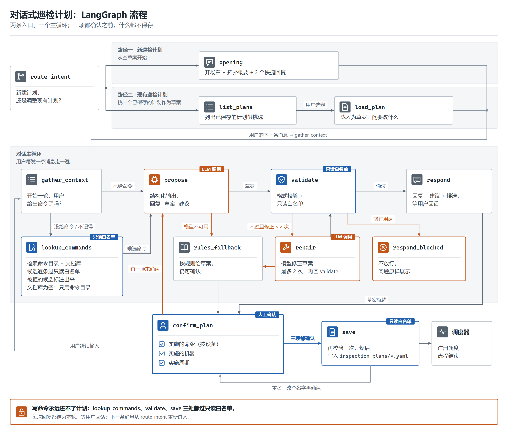
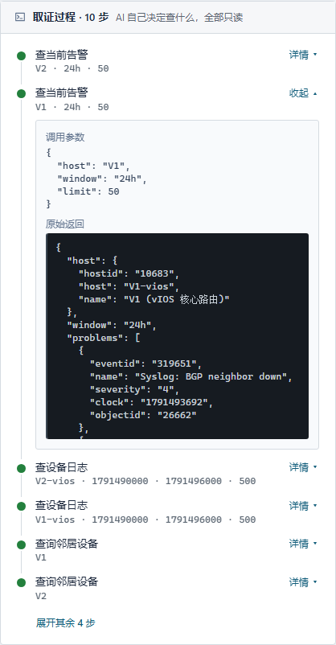
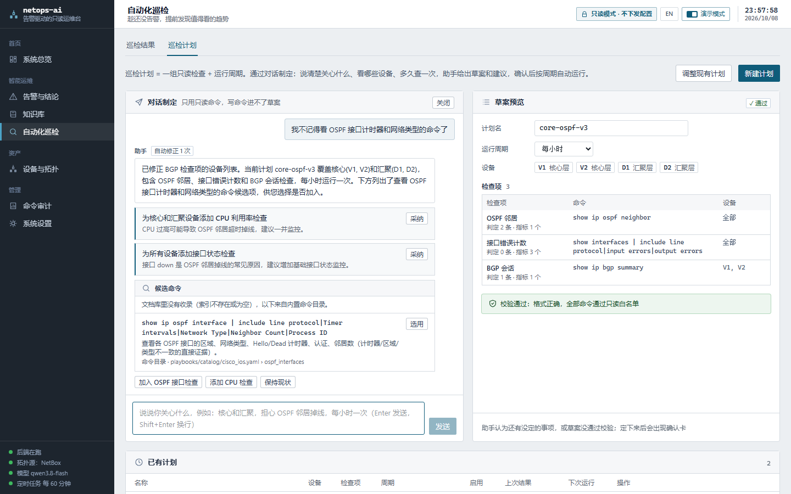
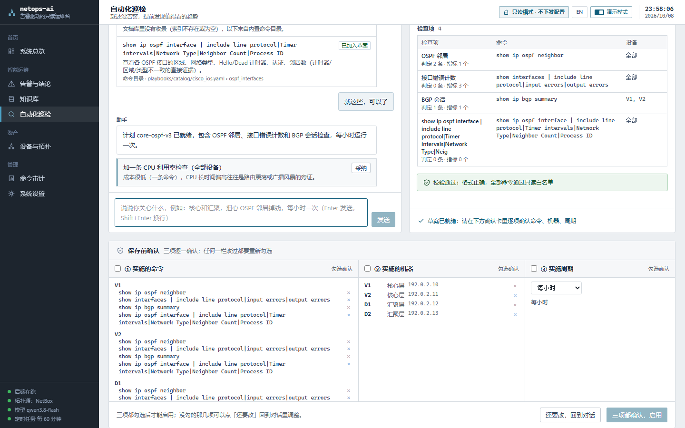

# netops-ai

[English](README.en.md) | **简体中文**

**告警驱动的只读 AI 网络排障。** 收到 Zabbix 告警后，AI 使用只读命令对相关设备取证，输出根因结论并引用其依据的原文，结果推送到飞书卡片和网页看板。

[部署](docs/INSTALL.zh-CN.md) · [接入 Zabbix 和 NetBox](docs/DEPLOY.zh-CN.md) · [实验环境](docs/LAB.zh-CN.md) · [架构](docs/ARCHITECTURE.zh-CN.md) · [剧本](docs/PLAYBOOK-FORMAT.zh-CN.md) · [贡献](CONTRIBUTING.zh-CN.md)

<p align="center"></p>

## 功能

- **告警流水线。** Zabbix 把告警 `POST` 到 `/webhooks/zabbix`；相关告警合并为一个事件；agent 只用只读工具取证；结论推送到飞书卡片和网页看板。
- **只读由代码保证。** 设备命令先过代码层白名单（只放行写全的 `show …`），并使用设备上的只读账号执行；Zabbix 客户端同样有方法白名单。
- **结构化结论。** 根因、置信度和引用的证据原文，并按六类假设逐项核对；无法判定时，写明缺少什么数据、用哪条命令可以确定。
- **拓扑。** 来自 NetBox（可选、只读，支持 webhook 刷新）或 YAML 文件。
- **剧本（SOP）。** YAML 格式的建议，只供 agent 参考，带 linter；六个示例：接口 down、OSPF 邻接、BGP 会话、设备重启、CPU 高、接口错误。
- **对话式巡检计划。** 在网页里通过对话制定巡检计划：说明关心什么、查哪些设备、多久查一次，助手给出检查项和周期建议；不记得命令时由助手到命令目录和文档库里查找。可新建，也可调整现有计划。**实施的命令、实施的机器、实施周期三项逐项确认后才保存并启用**；计划可暂停、改周期、删除，每次运行存档，可做趋势分析并导出报告。
- **定时巡检。** 基于 Zabbix 历史的趋势检测、只读登录设备的实时状态检查、历史记录、与上次结果对比、Markdown/HTML 导出。
- **调查轨迹与命令审计。** 每个事件记录 agent 的每一步调查（工具、参数、返回结果）；审计页列出 agent 执行过的每条命令和被白名单拒绝的每条命令。
- **本地文档检索（知识库）。** 对你自己的文档做关键词（BM25）检索：agent 的 `doc_search` 工具、知识库页面，以及巡检计划里的「帮我找命令」都用它。索引随仓库是空的，用 `tools/kb_ingest.py` 建；检索结果标注为文档参考，不当作设备证据。
- **网页看板。** 中英文界面：总览、告警与结论、拓扑、巡检、审计、知识库、设置；演示模式会遮盖 IP 地址和编号。
- **演示脚本。** `tools/demo_replay.py` 和 `tools/seed_demo.py`，无需实验环境即可向看板写入示例数据。

## 工作原理

- **合并。** 时间上相近的告警在一个短窗口（`ALERT_WINDOW_*`）内汇集并合并为一个事件，因此一条链路故障及其衍生的多条告警只产出一个结论；拓扑上相邻设备的告警也可以合并。
- **取证。** 一个工具调用循环：设有 token 预算、调用次数上限、重复调用拦截和无进展终止。剧本（YAML）只向 agent 提供建议，不执行任何操作。
- **两层只读守卫。** 第一层是代码：每条设备命令发出前先经过白名单检查；第二层是在设备上创建的只读账号。Zabbix 客户端同样设有方法白名单。

<p align="center"></p>

- **结论。** 模型按严格的结构输出。对六类假设（本端操作、本机硬件或资源、对端或上游、链路质量、管理面、监控采集自身问题）逐项给出：支持、已排除（须附反证）或无法判定；无法判定时须写明缺少哪些数据、用哪条命令可以确定。
- **巡检计划（对话制定）。** 对话流程是一张 LangGraph 状态图：入口区分新建和调整现有计划；每一轮由模型给出回复、草案和建议，草案立即经过格式校验和只读白名单，不通过则带着问题让模型修正（最多 2 次），仍不通过就不放行；用户不记得命令时，先在命令目录和文档库里检索候选，候选同样逐条过白名单；确认环节必须逐项确认命令、机器和周期，三项都确认才保存。写命令不可能进入计划。

<p align="center"></p>

- **巡检（无告警时）。** 两类检查，都由固定规则判定，不交给模型。*趋势巡检*只读取 Zabbix 历史，运行三个检测器：持续单向趋势（如错包计数持续增长）、周期性冲高、反复出现并自行恢复的抖动。*状态巡检*用只读账号登录每台设备，检查接口 up/up、OSPF 邻居全部 FULL、BGP 会话 Established，以及错误计数相对上次的增量；每条发现都引用设备输出原文。之后可选调用一次模型，把发现分为「今晚处理 / 可忽略（附理由）/ 无法判断」。每次结果都会存档，页面显示相比上次新增和消失的问题，报告可导出为 Markdown/HTML。阈值和扫描范围写在 `inspection.yaml`。

## 工具

**agent 能调用的工具**——全部只读、统一注册；完整列表见 [docs/ARCHITECTURE.zh-CN.md](docs/ARCHITECTURE.zh-CN.md#agent-能用的工具)。

| 工具 | 作用 |
|---|---|
| `zbx_*` | Zabbix 只读查询：主机、监控项、历史、趋势、syslog、问题、流量排行、图表 |
| `device_show` | 过命令白名单后，在设备上执行 `show` 命令 |
| `topology_neighbors` | 查询设备或接口的邻居——已配置 NetBox 时读取 NetBox，否则读取 `topology.yaml` |
| `nb_devices`、`nb_topology` | NetBox 台账（只读，仅在配置 NetBox 后可用） |
| `sop_lookup` | 查找匹配的剧本——仅提供建议，不执行 |
| `doc_search` | 对你自己的文档做关键词（BM25）检索 |
| `run_inspection`、`get_analysis` | 运行一次巡检、查询历史结论 |

**附带的命令行工具**（除标注外均可离线运行）：

| 命令 | 用途 |
|---|---|
| `python zbx-cli.py hosts` | 只读 Zabbix 命令行，与 agent 共用同一份工具定义；`python zbx-cli.py tools` 输出工具列表 |
| `python -m netops_ai.netbox_cli devices` | 只读 NetBox 台账命令行（`devices`、`neighbors <设备>`、`topology`）；需要 `NETBOX_URL` 和 `NETBOX_TOKEN` |
| `python tools/demo_replay.py` | 回放已落盘的告警记录并渲染飞书卡片，无需网络 |
| `python tools/seed_demo.py` | 向 `records/` 写入 6 条合成告警，供看板展示 |
| `python tools/sop_lint.py` | 检查剧本：工具和参数真实存在、命令能通过白名单 |
| `python tools/kb_ingest.py <目录>` | 用 `.md/.txt/.html/.pdf` 建本地文档索引（SQLite FTS5） |
| `python tools/llm_doctor.py` | 用多轮工具调用回放检查大模型接口（会调用模型） |

## 运行效果

以下截图均来自真实运行：虚拟 Cisco 实验网络（7 台、三层），故障在设备上手工注入，使用真实的 Zabbix、NetBox 和大模型，不含模拟数据。看板已开启演示模式，IP 地址已遮盖。

### 示例：BGP 邻居 shutdown

注入的故障：在 V1 上执行 `neighbor 10.0.0.2 shutdown`。会话两端共产生 6 条告警（SNMP trap、syslog、Zabbix 触发器），合并为**一个事件**，经只读工具取证后，输出一张卡片和一个看板页面。

**飞书卡片**（由该事件的卡片 JSON 渲染）：

<p align="center"></p>

**同一事件在看板上的展示**：结论、6 条引用的证据原文、两台设备的告警时间线、调查步骤、六类假设清单：

<p align="center"></p>

### 每一步查了什么

每个事件都保留 agent 的调查轨迹：调用了哪个工具、参数是什么、返回了什么，可逐步展开；审计页则汇总全部命令。

<p align="center"></p>

### 对话式制定巡检计划

助手一次只问最关键的问题，右侧实时显示草案和校验状态；用户忘记命令时，助手列出候选命令并标明出处，选用后并入草案。

<p align="center"></p>

保存前必须逐项确认实施的命令、实施的机器和实施周期：

<p align="center"></p>

### 看板其他页面

**系统总览**：已处理的故障数、出结论耗时、转人工次数、被白名单拦截的命令数：

<p align="center"></p>

**设备与拓扑**：读取自 NetBox 的分层拓扑，叠加近期故障：

<p align="center"></p>

**命令审计**：agent 执行过的每条命令和被白名单拒绝的每条命令：

<p align="center"></p>

**自动化巡检**：趋势发现，加上对每台设备的只读状态检查：

<p align="center"></p>

**知识库**：

<p align="center"></p>

### Lab 测试样例

每个故障均在实验设备上手工注入，测试后复位。下表为典型结果；由于取证由大模型完成，同一故障多次运行的结论会有波动。

| 注入的故障 | 系统结论 |
|---|---|
| 接口被手工 shutdown | 控制台执行 shutdown，高置信 |
| BGP 邻居被 shutdown | 一个事件覆盖两端：V1 上配置了 shutdown |
| 同一条链路的两端先后被 shutdown | 合并为一个事件，指出两个接口是同一条链路的两端 |
| OSPF hello / 认证 / area 不一致、passive 接口 | 合并为一个事件并指出不一致项；早期运行中对端的卡片偶尔会漏掉 |
| 设备 `reload` | 判定为 reload；由人还是脚本发起，结论为无法判定 |
| 接口抖动 | 控制台上反复 shutdown / no shutdown |
| 45 秒内自行恢复的故障 | 报告曾被关闭，并注明已经恢复 |
| 两个不相关的故障同时发生（一个接入口、一个 BGP 邻居） | 保持为两个独立事件 |
| 整台设备断电 | 各邻居侧均判定对端不可达，并列出无法判定的部分；各邻居的卡片目前尚未合并为一个事件 |

仅在实验环境（Cisco 虚拟拓扑）中验证，未经过生产环境验证。

## 部署步骤

三个层级，互不依赖。命令见 [docs/INSTALL.zh-CN.md](docs/INSTALL.zh-CN.md)；**Zabbix 和 NetBox 逐步配置（带图）见 [docs/DEPLOY.zh-CN.md](docs/DEPLOY.zh-CN.md)。**

<p align="center"></p>

```bash
git clone https://github.com/qifawu/netops-ai.git && cd netops-ai
python -m venv .venv && . .venv/bin/activate     # Windows：.venv\Scripts\activate
pip install -r requirements.txt                   # Python 3.13
```

1. **验证安装** —— `python -m pytest tests -q`（不需要设备、模型和凭证）。
2. **看板** —— `cd web && npm ci && npm run build && cd ..`，（可选）`python tools/seed_demo.py` 写入六条合成告警，再 `python -m uvicorn netops_ai.api.app:app --host 127.0.0.1 --port 8000`，打开 http://127.0.0.1:8000 。
3. **完整链路** —— `cp env.example .env` 后填写：Zabbix（只读用户）、设备（**只读账号**）、大模型接口，飞书可选；在 `topology.yaml` 里写你的设备；Zabbix 里加一个 webhook 媒介类型，POST 到 `/webhooks/zabbix`。Zabbix 和 NetBox 的具体配置步骤：[docs/DEPLOY.zh-CN.md](docs/DEPLOY.zh-CN.md)。

接口和看板**没有认证**：uvicorn 仅监听 `127.0.0.1`，前面应放置带认证的反向代理（nginx 示例见 [INSTALL.zh-CN.md](docs/INSTALL.zh-CN.md#保护接口和看板)）。

## 实验环境

<p align="center"></p>

在 EVE-NG 虚拟实验环境中开发和测试：三层共 7 台 Cisco IOS 节点，运行 OSPF 和 BGP，由 Zabbix 7.0 监控；故障在设备上手工注入。仅支持 Cisco IOS，未经生产环境测试；仓库不含设备镜像和配置。详情见 [docs/LAB.zh-CN.md](docs/LAB.zh-CN.md)。

## 可拓展方向

代码在以下方向预留了扩展点：

- **更多厂商。** 每个厂商是一套命令白名单规则、一份命令目录和几个剧本，Cisco IOS 可作为模板。
- **更多剧本。** 目前内置 6 个。剧本是一个小型 YAML 文件，编写方法见 [docs/PLAYBOOK-FORMAT.zh-CN.md](docs/PLAYBOOK-FORMAT.zh-CN.md)。
- **飞书之外的通知渠道**（群聊 webhook、邮件）。
- **内置认证**，使反向代理成为可选项。
- **更丰富的巡检规则**和状态检查（STP、端口聚合、电源和风扇）。

## 许可证

Apache-2.0，见 [LICENSE](LICENSE)。
