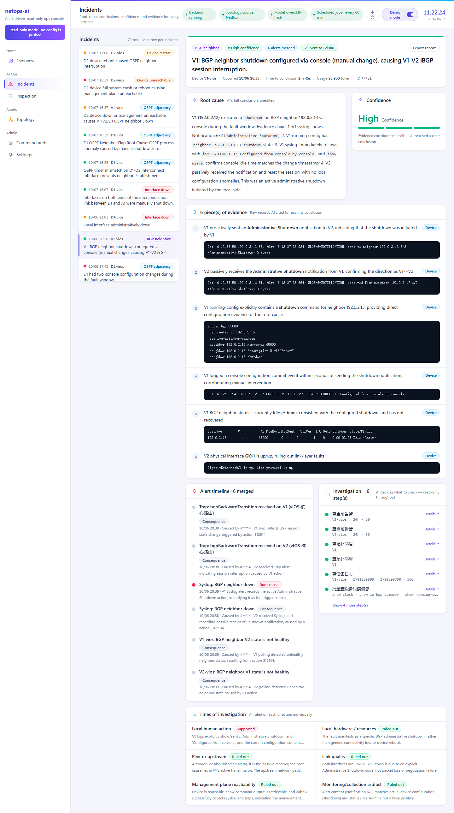
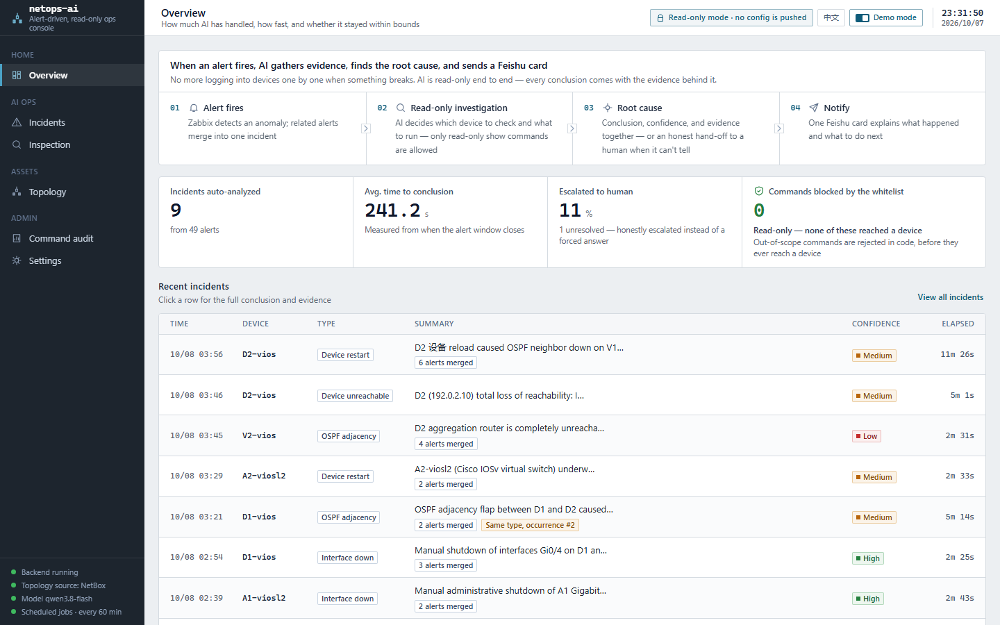
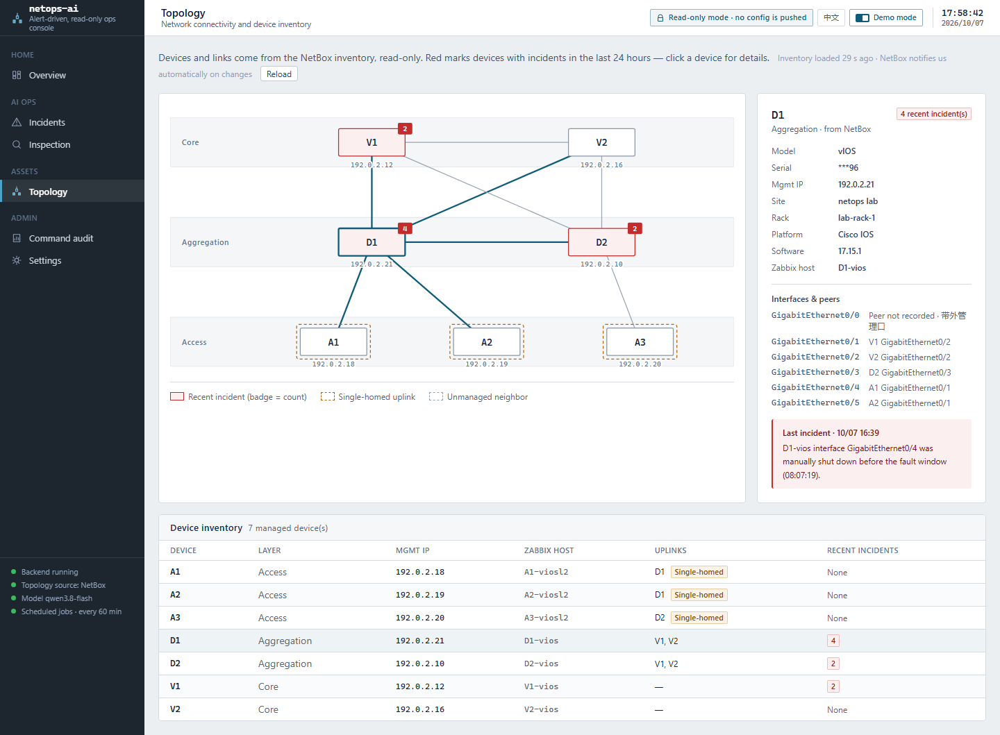
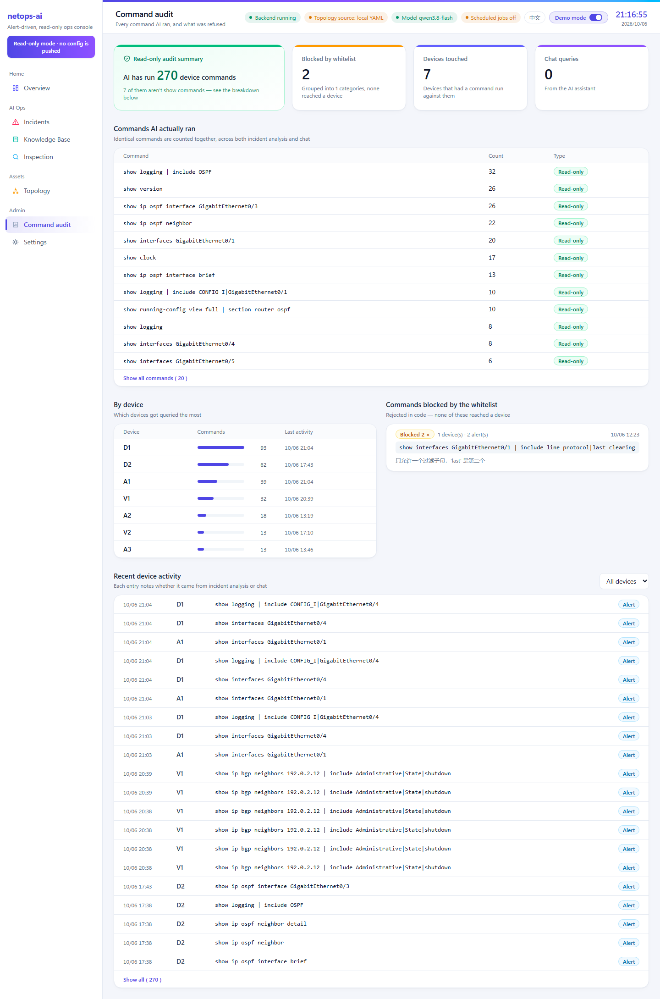
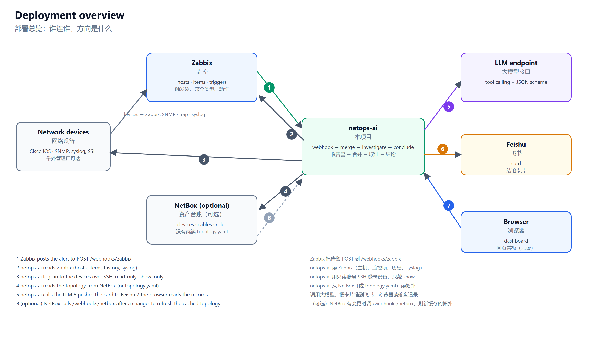
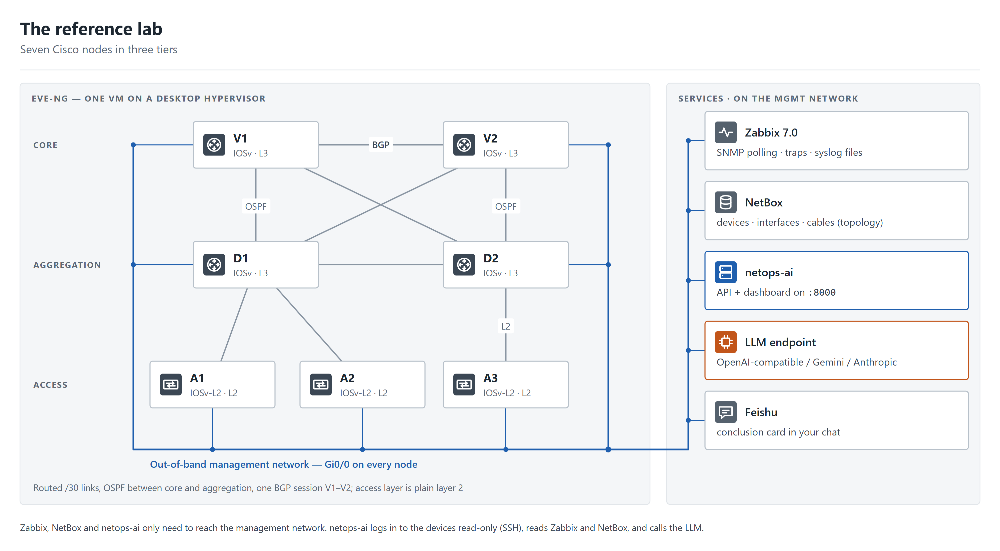

# netops-ai

**English** | [简体中文](README.zh-CN.md)

**Alert-driven, read-only AI network troubleshooting.** A Zabbix alert comes in, an AI agent investigates the devices with read-only commands, and you get a root-cause conclusion that quotes the evidence it used — on a Feishu card and a web dashboard.

[Install](docs/INSTALL.md) · [Deploy: Zabbix & NetBox](docs/DEPLOY.md) · [Lab](docs/LAB.md) · [Architecture](docs/ARCHITECTURE.md) · [Playbooks](docs/PLAYBOOK-FORMAT.md) · [Contributing](CONTRIBUTING.md)

<p align="center"></p>

## Current features

1. Zabbix sends an alert to `POST /webhooks/zabbix`.
2. Related alerts are merged into one incident.
3. The agent investigates with read-only tools only: Zabbix queries, `show` commands on the devices, topology neighbors, your playbooks.
4. It writes a structured conclusion: root cause, confidence, the evidence it quoted, and — when it can't tell — what is still unknown and which command would settle it.
5. The result goes to a Feishu card and the dashboard.

## How it works

- **Merge.** Alerts that arrive close together wait a short window (`ALERT_WINDOW_*`) and become one incident, so a link failure with ten knock-on alerts gives one conclusion, not ten.
- **Investigate.** One tool-calling loop with a token budget, call limits, duplicate-call blocking and a no-progress stop. Playbooks (YAML) only *advise* the agent; they never execute anything.
- **Two-layer read-only guard.** Layer 1 is code: every device command is checked against a whitelist before it is sent. Layer 2 is a read-only account you create on the device. The Zabbix client has a method whitelist the same way.

<p align="center"></p>

- **Conclude.** The model fills a strict schema. For each of six hypothesis families (local action, local hardware/resource, remote/upstream, link/path quality, management plane, monitoring artifact) it must say supported, ruled out (with counter-evidence) or undetermined — and "can't tell" must say what data and which command would settle it.

## More features

- Alert pipeline: webhook, merge window, incident de-duplication, Feishu card
- Read-only device access over SSH/Telnet (Cisco IOS) behind the command whitelist; read-only Zabbix client
- Structured conclusions with a six-family hypothesis checklist and an honest "can't tell"
- Topology from NetBox (optional, read-only, with a webhook for instant refresh) or from a YAML file
- Playbooks (SOP) as advice, with a linter; six examples: interface down, OSPF adjacency, BGP session, device restart, high CPU, interface errors
- Scheduled inspection: trend detectors on Zabbix history plus live read-only status checks, history, diff against the last run, Markdown/HTML export
- Command audit: every command the AI ran and every one that was refused
- Local documentation search (the index ships empty; fill it with `tools/kb_ingest.py`)
- Web dashboard in Chinese and English: overview, incidents, topology, inspection, audit, knowledge base, settings; a demo mode that masks IPs and IDs for screenshots
- Replay and demo-data scripts (`tools/demo_replay.py`, `tools/seed_demo.py`) for trying the dashboard without a lab

## Tools

**What the agent can call** — all read-only, registered in one place; the full list is in [docs/ARCHITECTURE.md](docs/ARCHITECTURE.md#the-tools-the-agent-can-use).

| Tool | What it does |
|---|---|
| `zbx_*` | Read-only Zabbix queries: hosts, items, history, trends, syslog, problems, top talkers, chart |
| `device_show` | Run a `show` command on a device, after the command whitelist |
| `topology_neighbors` | Neighbors of a device or interface — from NetBox if configured, else `topology.yaml` |
| `nb_devices`, `nb_topology` | NetBox inventory (read-only, when NetBox is configured) |
| `sop_lookup` | Find the matching playbook — it advises, it never executes |
| `doc_search` | Keyword (BM25) search over your own documents |
| `run_inspection`, `get_analysis` | Run an inspection, look up an earlier conclusion |

**Command-line tools** we ship, all runnable offline unless noted:

| Command | What it is for |
|---|---|
| `python zbx-cli.py hosts` | Read-only Zabbix CLI that shares the agent's tool definitions; `python zbx-cli.py tools` prints them |
| `python -m netops_ai.netbox_cli devices` | Read-only NetBox inventory CLI (`devices`, `neighbors <dev>`, `topology`); needs `NETBOX_URL` and `NETBOX_TOKEN` |
| `python tools/demo_replay.py` | Replay saved alert records and render the Feishu card, no network needed |
| `python tools/seed_demo.py` | Fill `records/` with six synthetic incidents so the dashboard has data |
| `python tools/sop_lint.py` | Lint playbooks: real tools, real parameters, commands the whitelist accepts |
| `python tools/kb_ingest.py <dir>` | Build the local documentation index (SQLite FTS5) from `.md/.txt/.html/.pdf` |
| `python tools/llm_doctor.py` | Check your LLM endpoint with a multi-turn tool-call replay (calls the model) |

## What it looks like

Everything below comes from real runs: a virtual Cisco lab (7 nodes, 3 layers), faults injected by hand on the devices, a real Zabbix, NetBox and LLM. No mock data. The dashboard's demo mode masks IP addresses.

### A real fault, end to end

We shut down a BGP neighbor on V1 (`neighbor 10.0.0.2 shutdown`). Six alerts arrived from both ends of the session (SNMP traps, syslog, Zabbix triggers). They were merged into **one incident**, investigated with read-only tools, and delivered as one card and one dashboard page.

**The card that lands in the chat** (rendered from the card JSON of that incident):

<p align="center"></p>

**The same incident on the dashboard** — conclusion, six pieces of quoted evidence, the alert timeline from both devices, the investigation steps, and the six-hypothesis checklist:

<p align="center"></p>

### The rest of the dashboard

**Overview** — how many incidents were handled, how fast, how many were honestly handed to a human, how many commands the whitelist blocked:

<p align="center"></p>

**Devices and topology** — layered topology read from NetBox, recent faults overlaid:

<p align="center"></p>

**Command audit** — every command the agent ran and every one the whitelist refused:

<p align="center"></p>

**Automated inspection** — trend findings plus read-only status checks of every device (screenshot in the Chinese UI):

<p align="center"></p>

**Knowledge base** and **settings** (Chinese UI; the dashboard also has an English UI):

<p align="center"></p>

### What we injected and what it said

Each fault was injected by hand on the lab devices and restored afterwards. Roughly what came out (results vary a little from run to run, because the investigation is done by an LLM):

| Fault | What the system concluded |
|---|---|
| Interface shut down by hand | Shut down from the console; high confidence |
| BGP neighbor shut down | One incident covering both ends: shut down on V1 |
| OSPF hello / authentication / area mismatch, passive interface | Names the mismatch on the side that has it; the far side sometimes misses it |
| Device `reload` | Reload; says honestly it cannot tell whether a person or a script did it |
| Interface flapping | Repeated shutdown / no shutdown from the console |
| Fault that heals itself in 45 s | Reports the shutdown and that it has already recovered |
| Two unrelated faults at once (an access port and a BGP neighbor) | Kept as separate incidents |
| Whole device powered off | The neighbors conclude "the far device is unreachable" and say what could not be told apart |

It is a lab-validated, read-only assistant, not a production-tested product.

## Deploy

Three levels; each works without the next. Commands: [docs/INSTALL.md](docs/INSTALL.md). **Step-by-step Zabbix and NetBox setup, with diagrams: [docs/DEPLOY.md](docs/DEPLOY.md).**

<p align="center"></p>

```bash
git clone https://github.com/qifawu/netops-ai.git && cd netops-ai
python -m venv .venv && . .venv/bin/activate     # Windows: .venv\Scripts\activate
pip install -r requirements.txt                   # Python 3.13
```

1. **Check the install** — `python -m pytest tests -q` (no devices, model or credentials needed).
2. **Dashboard** — `cd web && npm ci && npm run build && cd ..`, then (optional) `python tools/seed_demo.py` to fill it with six synthetic incidents, then `python -m uvicorn netops_ai.api.app:app --host 127.0.0.1 --port 8000` and open http://127.0.0.1:8000.
3. **Full pipeline** — `cp env.example .env` and fill in: Zabbix (read-only user), devices (**read-only account**), an LLM endpoint, optionally Feishu; list your devices in `topology.yaml`; in Zabbix add a webhook media type that posts to `/webhooks/zabbix`. What exactly to click in Zabbix and NetBox: [docs/DEPLOY.md](docs/DEPLOY.md).

The API and dashboard have **no login**: keep uvicorn on `127.0.0.1` and put an authenticating reverse proxy in front (nginx example in [INSTALL.md](docs/INSTALL.md#securing-the-api-and-dashboard)).

## The environment it was built and tested on

<p align="center"></p>

A virtual network in EVE-NG: 7 Cisco nodes in three layers (2 core and 2 aggregation IOSv, 3 access IOSv-L2), running OSPF and a BGP session, one Zabbix 7.0 server polling over SNMP and receiving traps. Faults were injected by hand on the devices (interface shutdown, OSPF neighbor loss, BGP session shutdown, reload) and the agent was checked against them. Cisco IOS only; not run in production. No device images or configs are included. Details and how to rebuild it: [docs/LAB.md](docs/LAB.md).

## Extension points

Where the code is built to be extended:

- **More vendors.** Each one is a command-whitelist ruleset, a command catalog and a few playbooks. Cisco IOS is the template.
- **More playbooks.** Six ship today. A playbook is a small YAML file; [docs/PLAYBOOK-FORMAT.md](docs/PLAYBOOK-FORMAT.md) has a ten-minute guide.
- **More notification channels** next to Feishu (chat webhooks, e-mail).
- **Built-in authentication** for the dashboard and webhook, so a reverse proxy is optional.
- **Richer inspection rules** and more status checks (STP, port-channel, power and fan).

## License

Apache-2.0 — [LICENSE](LICENSE).
