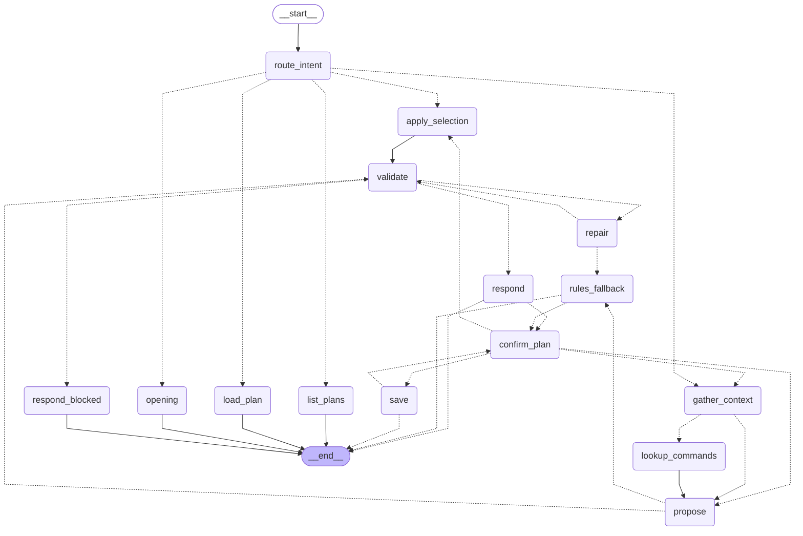

# Inspection plans

An inspection plan is a list of read-only checks per device plus a schedule. You do not fill in a form or write YAML: you **define it in a conversation** in the dashboard, the assistant drafts the plan and proposes improvements, and after you confirm the commands, the devices and the schedule it runs on its own. The built-in trend and status inspections use fixed checks; a plan is how you add your own.

## Creating a plan

**Inspection → Inspection plans → New plan** opens a two-pane panel: the conversation on the left, the live draft on the right.

1. **The assistant opens.** It lists what it sees in the topology (devices per role) and asks what worries you most, with quick replies such as "Neighbors and routing on the core", "Growing interface errors", "CPU and memory". The opening never calls the model.
2. **You answer in plain words**, e.g. *"core and aggregation devices; I mostly worry about OSPF neighbors going down and interface errors growing; hourly"*. Each turn the assistant returns a short reply (at most one or two questions — which faults matter, which devices are the focus, how often, how much alert noise is acceptable) and the **complete updated draft**.
3. **Suggestions come with a reason and an *Adopt* button.** For example: *core devices → add OSPF neighbor and BGP checks*; *counter checks should not run more often than every 5 minutes, or the trend is just noise*; *a trend needs at least 3 runs*; *access switches → watch the uplink error counters*. Adopting merges the change into the draft without another model call; suggestions that become redundant are marked as such.
4. **The draft pane** shows the plan name, the schedule (every 15 minutes, hourly, every 6 hours, or daily at a given time — editable right there), the devices, a table of checks and the validation result: green *"Valid: format OK, every command passes the read-only whitelist"*, or red with every problem listed.
5. **Confirmation card.** When the assistant considers the plan complete and the draft is valid, a card appears with three columns, each of which must be ticked separately: **① the commands** each device will run, **② the devices**, **③ the schedule**. Each column can be edited in place (remove a command or a device, change the schedule); editing a column clears its tick. *All three confirmed — enable* saves the plan. *Not yet — back to the conversation* returns to the assistant with the unticked items, e.g. *"I have not confirmed the schedule yet"*.

## Pickers and hints inside the conversation

You do not have to type everything. When the draft is missing something, the assistant's bubble carries an interactive picker for the first gap:

- **Device picker** (devices not decided yet — also offered in the opening message): devices grouped by layer (core / aggregation / access, from the topology or NetBox roles), each with its name, neighbor count and management address (masked in demo mode). Quick buttons *All core*, *All aggregation*, *All access*, *All devices*; *Select all* / *Clear* per group; devices already in the draft are pre-ticked. **Pick devices** next to *Devices* in the draft pane reopens it at any time.
- **Schedule picker**: chips for every 15 minutes, hourly, every 6 hours, or daily at a chosen time; a click writes it to the draft. A one-line reason sits next to it (counter checks no more often than every 5 minutes, a trend needs at least 3 runs).
- **Check picker**: one row per check template with its purpose and the command it will run (expandable), recommended items pre-ticked for the chosen device roles. If you can't remember a command, describe it in words and the command lookup below still applies.

Submitting a picker sends the choice back as a structured message: it is applied to the draft **deterministically, without calling the model** (devices must exist in the topology, templates in the template library, the schedule must be valid), and the next picker follows until nothing is missing — then the confirmation card appears. A submitted picker turns into a one-line read-only summary (*Selected: Core 2, Aggregation 2*) with a *Change* link; only the newest picker in the conversation can be used, older ones are marked expired and rejected by the server. Pickers work with the keyboard (Tab, Space to tick, Enter to confirm).

Below an assistant reply there may also be up to two **hints** — lighter than suggestions (small grey text, a thin bar on the left, not clickable) and produced by rules, not by the model: *write commands are never accepted*, *for core devices watch OSPF and BGP*, *counter checks no more often than every 5 minutes*, *a trend needs at least 3 runs*. Each hint appears once per conversation and can be dismissed.

## Adjusting an existing plan

Click **Adjust** on a plan row (or **Adjust a plan** at the top and pick one from the list the assistant shows: name, devices, checks, schedule, enabled, last result). The plan is loaded as the draft and the assistant asks what to change: add or remove checks or commands, other devices, the schedule, or pausing the plan. The same validation and the same three-item confirmation apply; confirming writes the changes back to the same plan.

## Renaming, pausing, deleting

- **Schedule and pause** can also be changed directly in the plan list (schedule dropdown, enable switch). A new schedule counts from now; a run that is already in progress is not interrupted (it read the plan when it started).
- **Rename** in the expanded plan (or by changing the name in the draft while adjusting). The new name must be free and may only contain letters, digits, `_`, `.`, `-`; a running plan cannot be renamed. Earlier run records keep the old name.
- **Delete** asks for confirmation first and lists exactly what will be removed: the plan file `inspection-plans/<name>.yaml`, and — only if you tick *Also delete this plan's run history* (unticked by default) — this plan's own run files under `records/checklist-runs/` (exact name match, so deleting `core` never touches `core-health`) and its saved trend conclusion. **A running plan cannot be deleted**: the request is refused (409, "running, try again after it finishes") rather than interrupting the run. The API takes no path parameters; unknown plans return 404. Once deleted, the scheduler no longer starts it.

## Exporting a report

Each expanded plan has **Export report** with a format selector (Markdown or self-contained HTML), same renderer as the built-in inspection export. The report contains the plan definition (devices, commands, schedule), a summary of the selected runs (`runs=N`, default 20 in the UI), the latest result per device and check with the raw device output as evidence, a metric table with the values of every run, the list of failures, and the latest trend-analysis conclusion if one was made. It contains no credentials. As with the built-in inspection export, the file has the real content: the dashboard's demo mode only masks what is shown on screen.

Sample (excerpt from a real run in the lab; addresses replaced with documentation addresses):

````markdown
# 巡检计划报告：plan-test-2

- 状态：启用；周期：每 15 分钟
- 运行区间：2026-10-08T15:29:22+00:00 — 2026-10-08T15:29:22+00:00，共 1 次

## 3. 最近一次结果（2026-10-08T15:29:22+00:00，运行 8cb982a6）

| 设备 | 检查项 | 结果 | 指标 / 说明 |
|---|---|---|---|
| V1 | ospf_neighbors | 通过 | ospf_full=3 |
| V1 | cpu | 通过 | cpu_5s=0，cpu_1m=0，cpu_5m=0 |

### 设备输出原文（证据）

V1 · ospf_neighbors · `show ip ospf neighbor` · 通过

```
Neighbor ID     Pri   State           Dead Time   Address         Interface
4.4.4.4           0   FULL/  -        00:00:32    10.0.1.6        GigabitEthernet0/3
3.3.3.3           0   FULL/  -        00:00:34    10.0.1.2        GigabitEthernet0/2
2.2.2.2           0   FULL/  -        00:00:38    10.0.0.2        GigabitEthernet0/1
```
````

## When you don't remember a command

Describe what you want to see instead — *"check whether OSPF neighbors dropped"*, *"are interface errors growing?"*, *"I don't remember the BGP command"*. The assistant first searches the documentation library and lists candidate commands under its reply, each with its source (file › section), a one-line purpose, and a **Use** button. Nothing enters the draft until you pick a candidate. Two sources are searched:

- the built-in command catalog `playbooks/catalog/cisco_ios.yaml` (keywords against intent, command and purpose), and
- your documentation index (`netops_ai/docs_kb`, SQLite FTS5 — see below): `show …` commands found in the matching passages.

Every candidate is checked against the read-only whitelist; a refused one is listed struck through and marked *Not usable: refused by the read-only whitelist*. If the index does not exist or is empty, the assistant says so (*"the documentation library has no index; the candidates below come from the built-in command catalog"*). Search results are a reference for commands and their purpose, never device evidence.

### Building the documentation library

```bash
python tools/kb_ingest.py examples/kb                 # try it with the three sample notes
python tools/kb_ingest.py /path/to/your/docs          # .md / .txt / .html / .pdf (PDF needs pypdf)
```

The index is written to `records/docs_kb.db` (set `DOC_SEARCH_DB` in `.env` to use another path). Ingestion is incremental: unchanged files are skipped. **Only ingest documents you are licensed to use.** The same index serves the Knowledge page and the agent's `doc_search` tool.

## Safety

- **Read-only, enforced in code.** Every draft is validated on every turn with the same command whitelist the device adapter uses. If the model proposes a command the whitelist refuses (a `configure`, `clear`, `reload`, …) or a malformed rule, the problems are sent back to the model to fix — **at most twice**. If it is still wrong, the problems are shown to you verbatim, the offending checks are removed from the draft and the plan cannot be confirmed. Saving validates once more. A write command can never reach a device: the adapter checks the whitelist again on every run.
- **Templates instead of improvised regexes.** The model picks checks from a template library (interface status, OSPF neighbors, BGP sessions, interface error counters, uplink error counters, CPU, memory) whose rules and metric extractors are written in code. A custom check (from a command you picked, or written by the model when no template fits) goes through the same validation.
- **What the model sees.** Device names, roles and neighbor counts from the topology, the template library, the command catalog, any command candidates, the current draft and the conversation. No management addresses and no credentials; addresses are filled in from the topology.
- **No model, no problem.** If no LLM is configured or the call fails, the reply says *"The model is unavailable; below is a rule-based recommendation"*: devices by role (core and aggregation by default, or what you named), the recommended templates per role and the schedule recognised in your message (hourly by default). It goes through the same confirmation card.
- **Replies follow the UI language** (Chinese or English); plan names and check ids are English identifiers.

## How plans run

- Plans are stored as `inspection-plans/<name>.yaml` in the repository root (names: letters, digits, `_`, `.`, `-`). The format is a checklist (below) plus `schedule` (`{every_minutes: N}` or `{daily_at: "HH:MM"}`, server local time) and `enabled`.
- A background thread in the backend checks every minute which enabled plans are due. The next run is counted from the later of the last run and the moment the plan was (re)enabled or its schedule changed, so a paused plan does not trigger a catch-up run. This thread is independent of `SCHEDULE_INTERVAL_MINUTES`.
- The same plan never runs twice at once: a second start (scheduled or *Run now*) while one is running is refused, not queued.
- Each run writes one JSON file to `records/checklist-runs/`. The latest status of each plan is added to `records/schedule-state.json` under `plans`; the status dot in the sidebar includes it.
- The plan list shows, per plan: devices, checks, schedule (editable), an enable/pause switch, the last result, the next run, **Run now**, **Trend** and **Adjust**. Expanding a plan shows the run history, a mini trend line per metric, the latest result per device and check (with the raw output of failing checks) and the trend analysis.
- Device credentials come from `.env` (`DEVICE_USERNAME`, `DEVICE_PASSWORD`, `DEVICE_VENDOR`, `DEVICE_TRANSPORT`): use a read-only account. Device addresses are taken from the current topology at run time.

### API

| Method | Path | |
|---|---|---|
| POST | `/api/inspection/plans/chat` | one turn: `{session, messages, draft?, lang, mode: new\|edit, plan?}` → `{reply, draft, validation: {ok, problems, missing}, ready, suggestions, candidates, quick_replies, awaiting_confirm, confirm_card}` |
| POST | `/api/inspection/plans/confirm` | `{session, draft, confirmed: {commands, devices, schedule}}`: all three true → save; otherwise back to the conversation (409 if nothing is waiting for confirmation) |
| POST | `/api/inspection/plans/draft` | merge a suggestion's or a picked command's `patch` into a draft / re-validate (no model call) |
| GET | `/api/inspection/plans` | list with last run and next run time |
| POST | `/api/inspection/plans` | save directly, without the conversation (validated again; 400 with the problems, 409 if the name exists) |
| PATCH | `/api/inspection/plans/{name}` | `{enabled?, schedule?, name?}` (rename: 409 if taken or running) |
| GET | `/api/inspection/plans/{name}/delete-preview` | what a delete would remove: plan file, number of run files, running or not |
| DELETE | `/api/inspection/plans/{name}?with_history=false` | delete the plan (and, with `with_history=true`, its own run files and trend); 409 while running, 404 if unknown |
| GET | `/api/inspection/plans/{name}/report?format=md\|html&runs=N` | export the report |
| POST | `/api/inspection/plans/{name}/run` | run once now (409 if it is already running) |
| GET | `/api/inspection/plans/{name}/runs` | run history, newest first |
| POST | `/api/inspection/plans/{name}/trend` | trend analysis by the model; without a model, the trend table and the prompt |

## Checklist format (for reference)

```yaml
name: core-health
vendor: cisco
devices:
  - {name: D1, host: 192.0.2.10}
checks:
  - id: ospf
    command: show ip ospf neighbor
    devices: [D1]                 # optional: only on these devices (default: all)
    expect:
      - {type: contains, value: FULL, severity: critical}
    extract:
      - {name: ospf_full, regex: '(FULL)/', agg: count}
```

- `expect` rules: `contains`, `not_contains`, `regex`, `not_regex`, each with a `severity` of `info`, `warning` or `critical`. Pass / fail comes from these rules only — no model is involved in the verdict.
- `extract` rules: a regex with one capture group, `cast` to `int` or `float`, and `agg`: `first` (default), `sum`, `max` or `count` (number of matches) — e.g. the sum of input errors over all interfaces.
- An unreachable device is recorded as such and the run continues with the next device. Output is stored capped at 6000 characters.

## Command line

The CLI reads and writes the same files:

```bash
python tools/checklist_run.py validate examples/checklists/core-health.yaml   # format + read-only whitelist
python tools/checklist_run.py run      examples/checklists/core-health.yaml   # one run, stored as JSON
python tools/checklist_run.py run      my-plan                                # a plan saved from the dashboard
python tools/checklist_run.py trend    my-plan --last 12 --ask-llm            # trend analysis by the model
```

`run` exits with code 2 when at least one check failed, errored or a device was unreachable. The trend prompt (`TREND_SYSTEM_PROMPT` in `netops_ai/inspection/checklist.py`) requires run-id citations, separates a one-off spike from a trend, treats a counter that drops as a reset, and asks for the data or command that would settle anything it cannot judge.

Cisco IOS only for now.

## Appendix: conversation flow

One conversation is one thread of a LangGraph `StateGraph` (`netops_ai/graph/plan_graph.py`, checkpointer `MemorySaver`, thread id = conversation id). The nodes only orchestrate; the logic lives in plain functions in `netops_ai/inspection/plan_chat.py`, `plans.py` and `command_lookup.py`. State: `messages`, `draft`, `validation`, `repairs`, `suggestions`, `lang`, `ready`, plus the entry mode, command candidates and per-turn intermediates.

| Node | Responsibility |
|---|---|
| `route_intent` | Entry. A submitted picker → `apply_selection`. *New plan* → start from an empty draft; *adjust* → list the plans or load the chosen one; a message in a new-plan panel that names an existing plan with "adjust/modify" switches to the adjust path. |
| `apply_selection` | Deterministic, no model call: checks a picker submission (only the newest picker counts; devices in the topology, templates in the library, valid schedule) and writes it into the draft, then `validate` → `respond`. |
| `opening` | New plan, no message yet: greeting with a topology summary, the device picker and quick replies. No model call. |
| `list_plans` | Adjust, no plan chosen: lists the saved plans (name, devices, checks, schedule, enabled, last result) to pick from. |
| `load_plan` | Loads the chosen plan as the draft and asks what to change. |
| `gather_context` | Starts a turn; decides whether the user described something to check without giving a command (or said they don't remember it). |
| `lookup_commands` | Searches the command catalog and the documentation index, checks every candidate against the whitelist, degrades to the catalog when the index is missing or empty. |
| `propose` | One model call with structured output: reply, complete draft, suggestions, `ready`, `enabled`. Context: device names / roles / neighbor counts (no addresses, no credentials), templates, command catalog, candidates, current draft. |
| `validate` | Expands templates, fills addresses from the topology, runs the checklist validator including the read-only command whitelist. |
| `repair` | Sends the problems back to the model for a corrected full draft (at most 2 times), then back to `validate`. |
| `respond` | Reply, model + rule-based suggestions, candidates and hints. If the draft still lacks devices / schedule / checks it attaches the matching picker and stops; only when nothing is missing does it go on to `confirm_plan`. |
| `respond_blocked` | Still invalid after 2 corrections: problems shown verbatim, offending checks removed, cannot be confirmed. |
| `rules_fallback` | Model unavailable: rule-based draft that can still be confirmed through the card. |
| `confirm_plan` | Human-in-the-loop interrupt with the three-item card (commands per device, devices, schedule). All three confirmed → `save`; any item not confirmed → `propose`; a picker submitted before confirming → `apply_selection`; another chat message → `gather_context`. |
| `save` | Validates once more, writes `inspection-plans/<name>.yaml` (the same file when adjusting), the scheduler picks it up. Name already taken → back to `confirm_plan`. |

Generated with `compiled.get_graph().draw_mermaid()` (`python -c "from netops_ai.graph.plan_graph import mermaid; print(mermaid())"`):


