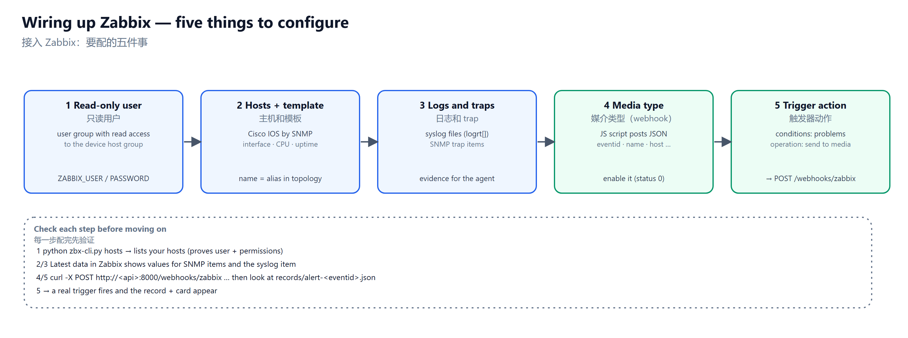
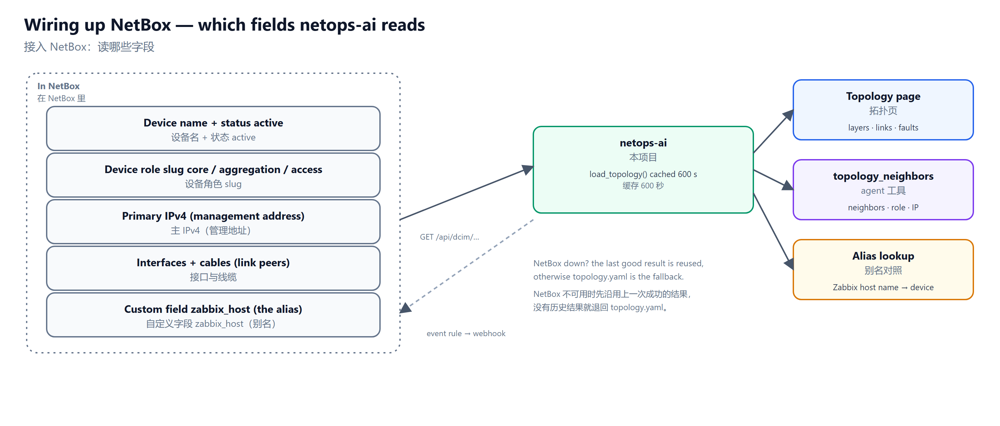

# Deployment guide: connecting Zabbix and NetBox

**English** | [简体中文](DEPLOY.zh-CN.md)

[INSTALL.md](INSTALL.md) lists the commands. This page explains **what to configure on the Zabbix and NetBox side, in what order, and how to check each step**. You can stop after Zabbix; NetBox is optional.

## The picture first

<p align="center"></p>

netops-ai only ever **reads**: Zabbix (arrow 2), the devices (3), NetBox (4). The two inbound arrows are webhooks: Zabbix → `/webhooks/zabbix` (1, required) and NetBox → `/webhooks/netbox` (8, optional, only for faster topology refresh).

Network requirements:

| From | To | Port | Why |
|---|---|---|---|
| netops-ai | Zabbix web/API | 80/443 (or your port) | read API |
| netops-ai | devices | 22 (SSH) | read-only `show` commands |
| netops-ai | NetBox | 80/443 | read topology (optional) |
| netops-ai | LLM endpoint | 443 | the investigation |
| Zabbix server | netops-ai | 8000 (or your proxy) | alert webhook |
| NetBox | netops-ai | 8000 (or your proxy) | change webhook (optional) |

## Part 1 — Zabbix

Tested with Zabbix 7.0. Menu names below are those of 7.0; other versions are similar.

<p align="center"></p>

### 1. A read-only user for netops-ai

netops-ai logs in to the Zabbix API with a user name and password and calls only whitelisted read methods. Still give it a user that cannot write:

1. **Users → User groups → Create**: name `netops-ai-ro`. Under *Host permissions* add the host group(s) that contain your network devices with permission **Read**. Leave everything else at *None*.
2. **Users → Users → Create**: user `netops-ai`, member of that group, role **User** (not Admin / Super admin). Make sure the role allows API access (*Users → User roles → Access to API*).
3. Put the credentials in `.env`:

```ini
ZABBIX_URL=http://<zabbix-host>:<port>      # the web frontend URL
ZABBIX_USER=netops-ai
ZABBIX_PASSWORD=<password>
```

**Check:** `python zbx-cli.py hosts` lists your devices. An empty list means the group permission is missing; an auth error means the user/password or the API-access role.

### 2. Hosts and template

1. **Data collection → Hosts → Create host** for each device. Host name = the name you want to see in alerts (e.g. `D1`); group = the group from step 1; add an **SNMP interface** with the device's management IP and community (or SNMPv3 credentials).
2. Link the template **Cisco IOS by SNMP** (for other vendors pick the matching template). It gives you interface status, CPU, memory, uptime and the "interface down" triggers.
3. On the device, enable SNMP and allow the Zabbix server's address.

**The host name is the alias.** netops-ai matches an alert to a device by name and does not guess: either name the Zabbix host exactly like the device in `topology.yaml` / NetBox, or list the Zabbix name under `aliases:`. If every alert shows "unknown host", this is the cause.

**Check:** *Monitoring → Latest data* for the host shows values for the interface and CPU items within a few minutes.

### 3. Logs and traps (optional, but they make conclusions better)

Syslog and SNMP traps give the agent the "who did what, when" evidence (for example `%SYS-5-CONFIG_I: Configured from console`).

- **Syslog**: have the devices send syslog to a collector that writes files the Zabbix server/agent can read, and add a **log-type item** (`log[...]` / `logrt[...]`) on the host. The `zbx_syslog` tool reads any log-type item of the host; if the host has none, it says so.
- **SNMP traps**: run `snmptrapd` writing to a file and add an `snmptrap[...]` item. Lab scripts are in `deploy/trap/`; read them before running anything.

**Check:** trigger a harmless event in a lab (for example `shutdown` / `no shutdown` on a spare interface) and see a new value in *Latest data*.

### 4. The webhook media type

*Alerts → Media types → Create media type*, type **Webhook**:

- Name: `netops-ai`
- Parameters (name → value): `url` → `http://<netops-ai-host>:8000/webhooks/zabbix`, `eventid` → `{EVENT.ID}`, `name` → `{EVENT.NAME}`, `severity` → `{EVENT.NSEVERITY}`, `hostid` → `{HOST.ID}`, `host` → `{HOST.NAME}`
- Script:

```js
var p = JSON.parse(value);
var req = new HttpRequest();
req.addHeader('Content-Type: application/json');
req.post(p.url, JSON.stringify({eventid: p.eventid, name: p.name, severity: p.severity, hostid: p.hostid, host: p.host}));
if (req.getStatus() !== 200) { throw 'webhook returned ' + req.getStatus(); }
return 'OK';
```

- Make sure **Enabled** is ticked. A media type created through the API is disabled by default, and then the first alert silently never arrives.
- Test it from the media type's *Test* button, or without Zabbix:

```bash
curl -X POST http://<netops-ai-host>:8000/webhooks/zabbix \
  -H 'content-type: application/json' \
  -d '{"eventid":"1","name":"Interface Gi0/1(): Link down","host":"A1"}'
```

**Check:** `records/alert-1.json` appears and the dashboard shows an incident. (It will carry errors for whatever you have not configured yet.)

### 5. A user media and a trigger action

1. The media type needs a recipient: *Users → Users →* the user that should "receive" the alerts (a dedicated user is fine) *→ Media → Add*: type `netops-ai`, any *Send to* text (for example `netops-ai`), all severities.
2. **Alerts → Actions → Trigger actions → Create action**: condition — for example *Host group equals your device group*; operation — *Send message* to that user via the media type `netops-ai`. Add a **recovery operation** as well, so recoveries reach netops-ai too.

**Check:** cause a real fault in the lab. After the merge window (`ALERT_WINDOW_*`) a record and a Feishu card appear.

### Reachability notes

- The Zabbix **server** (not your browser) must be able to reach the URL. If netops-ai listens on `127.0.0.1`, put a reverse proxy in front or listen on a trusted interface; see [Securing the API and dashboard](INSTALL.md#securing-the-api-and-dashboard). Restrict `/webhooks/zabbix` by source address.
- Zabbix webhook scripts time out at 60 s; the endpoint returns immediately and does the analysis in the background.

## Part 2 — NetBox (optional)

Without NetBox the topology comes from `topology.yaml`. With NetBox, devices and links are read from it, and `topology.yaml` stays as the fallback.

<p align="center"></p>

### 1. What to enter in NetBox

| NetBox object / field | What to put there | Used for |
|---|---|---|
| Device → name, **status** | `D1`, status *Active* | only *active* devices are drawn and used as neighbors |
| Device → **role** (slug) | `core`, `aggregation` or `access` | topology layers; "is this neighbor above me" |
| Device → **primary IPv4** | the management IP | the address the agent connects to |
| Interfaces + **cables** | connect interface A to interface B | the links |
| Device → custom field **`zabbix_host`** | the Zabbix host name, e.g. `D1-vios` | the alias; no fuzzy matching |

To add the custom field: *Customization → Custom fields → Create*, object type **DCIM > device**, name `zabbix_host`, type *Text*. Fill it in when the Zabbix host name differs from the NetBox device name.

Optional fields shown in the device details: device type, platform, site, rack, serial, custom field `software_version`.

### 2. A read-only API token

*Admin → API tokens → Add*. NetBox 4.7+ gives a v2 token shown once as `nbt_<key>.<plaintext>`: paste the whole string. Older v1 tokens work too. Untick *Write enabled*. Then:

```ini
NETBOX_URL=http://<netbox-host>:<port>
NETBOX_TOKEN=nbt_xxxxxxxx.xxxxxxxx
```

netops-ai only sends GET requests to `/api/dcim/devices/` and `/api/dcim/interfaces/`.

**Check:** `python -m netops_ai.netbox_cli devices` lists your devices; `python -m netops_ai.netbox_cli topology` shows layers and links; the dashboard's topology page says "Topology source: NetBox".

### 3. Instant refresh with a webhook (optional)

Without it the topology is re-read every `TOPOLOGY_CACHE_TTL` seconds (default 600). To refresh right after you edit NetBox:

1. *Integrations → Webhooks → Add*: URL `http://<netops-ai-host>:8000/webhooks/netbox`, method POST, content type `application/json`, **Secret** = a random string.
2. *Integrations → Event rules → Add*: object types device, interface, cable; events created / updated / deleted; action = that webhook.
3. In `.env`: `NETBOX_WEBHOOK_SECRET=<the same string>`. The request is verified with an HMAC-SHA512 signature (`X-Hub-Signature`); a wrong signature is rejected.

### 4. If NetBox is down

The last good result is reused for a while (the page says so); with no earlier result netops-ai falls back to `topology.yaml` and records why. Keep `topology.yaml` roughly current, or at least listing the aliases.

## `.env` at a glance

| Setting | Where it comes from | Required |
|---|---|---|
| `ZABBIX_URL`, `ZABBIX_USER`, `ZABBIX_PASSWORD` | Zabbix step 1 | yes |
| `DEVICE_USERNAME`, `DEVICE_PASSWORD`, `DEVICE_VENDOR=cisco`, `DEVICE_TRANSPORT` | read-only device account ([INSTALL §3.2](INSTALL.md#32-devices-the-read-only-account)) | yes |
| `LLM_BASE_URL`, `LLM_API_KEY`, `LLM_MODEL` | your LLM endpoint | yes |
| `FEISHU_WEBHOOK_URL` (or the app triple) | card delivery | no |
| `NETBOX_URL`, `NETBOX_TOKEN`, `NETBOX_WEBHOOK_SECRET`, `TOPOLOGY_CACHE_TTL` | NetBox | no |

## Checklist

1. `python zbx-cli.py hosts` lists the devices.
2. `python tools/llm_doctor.py` passes.
3. The `curl` test creates `records/alert-1.json`.
4. A real fault produces a card and a dashboard incident.
5. (NetBox) `netbox_cli topology` shows layers and links.

If something does not arrive, see *Troubleshooting* at the end of [INSTALL.md](INSTALL.md).
