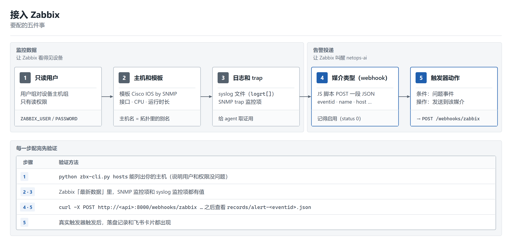
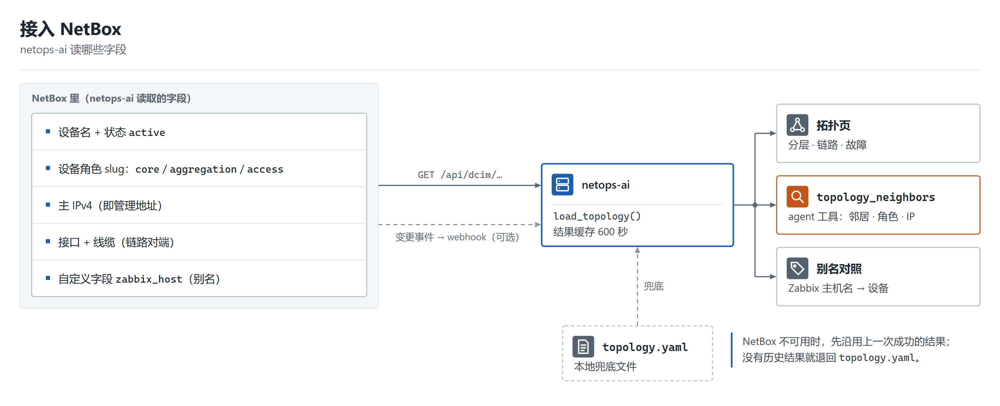

# 部署指南：接入 Zabbix 和 NetBox

[English](DEPLOY.md) | **简体中文**

[INSTALL.zh-CN.md](INSTALL.zh-CN.md) 列的是命令。这一页讲的是 **Zabbix 和 NetBox 那一侧具体要配什么、按什么顺序配、每一步怎么验证**。只接 Zabbix 就能跑，NetBox 是可选的。

## 先看图

<p align="center"></p>

netops-ai 对外只做**读**：读 Zabbix（箭头 2）、读设备（3）、读 NetBox（4）。进来的两条线是 webhook：Zabbix → `/webhooks/zabbix`（1，必需）；NetBox → `/webhooks/netbox`（8，可选，只为让拓扑刷新更快）。

网络连通要求：

| 从 | 到 | 端口 | 用途 |
|---|---|---|---|
| netops-ai | Zabbix 网页/API | 80/443（或你的端口） | 读 API |
| netops-ai | 设备 | 22（SSH） | 只读 `show` 命令 |
| netops-ai | NetBox | 80/443 | 读拓扑（可选） |
| netops-ai | 大模型接口 | 443 | 取证推理 |
| Zabbix 服务器 | netops-ai | 8000（或你的反向代理） | 告警 webhook |
| NetBox | netops-ai | 8000（或你的反向代理） | 变更 webhook（可选） |

## 第一部分 — Zabbix

用 Zabbix 7.0 测过。下面的菜单名是 7.0 的，其它版本大同小异。

<p align="center"></p>

### 1. 给 netops-ai 一个只读用户

netops-ai 用用户名和密码登录 Zabbix API，只调白名单里的读方法。即便如此，也请给它一个没有写权限的用户：

1. **用户 → 用户群组 → 创建**：名称 `netops-ai-ro`。在「主机权限」里加上包含网络设备的主机群组，权限选**只读**，其余保持「无」。
2. **用户 → 用户 → 创建**：用户名 `netops-ai`，加入上面的群组，角色选 **User**（不要用 Admin / Super admin）。确认该角色允许访问 API（用户 → 用户角色 → API 访问）。
3. 把凭证写进 `.env`：

```ini
ZABBIX_URL=http://<zabbix-host>:<port>      # 网页前端的地址
ZABBIX_USER=netops-ai
ZABBIX_PASSWORD=<password>
```

**验证：** `python zbx-cli.py hosts` 能列出你的设备。列表为空说明群组权限没给；报认证错误说明用户名/密码或 API 访问权限有问题。

### 2. 主机和模板

1. **数据采集 → 主机 → 创建主机**，每台设备一个。主机名就是你希望在告警里看到的名字（如 `D1`）；群组选上一步那个；加一个 **SNMP 接口**，填设备的管理 IP 和团体名（或 SNMPv3 凭证）。
2. 链接模板 **Cisco IOS by SNMP**（别的厂商选对应模板）。它带来接口状态、CPU、内存、运行时间和「接口 down」触发器。
3. 设备上开启 SNMP，并允许 Zabbix 服务器的地址访问。

**主机名就是别名。** netops-ai 按名字把告警对应到设备，不会猜：要么让 Zabbix 主机名和 `topology.yaml` / NetBox 里的设备名完全一样，要么把 Zabbix 里的名字写进 `aliases:`。如果所有告警都显示「未知主机」，原因就在这。

**验证：** 「监测 → 最新数据」里，这台主机的接口和 CPU 监控项几分钟内有值。

### 3. 日志和 trap（可选，但能让结论更好）

syslog 和 SNMP trap 给 agent 提供「谁在什么时候做了什么」的证据（比如 `%SYS-5-CONFIG_I: Configured from console`）。

- **Syslog**：让设备把 syslog 发到一台收集机，写成 Zabbix 服务器/agent 能读的文件，然后在主机上加一个**日志类型监控项**（`log[...]` / `logrt[...]`）。`zbx_syslog` 工具会读这台主机上任意一个日志类型的监控项；一个都没有时它会如实说没有。
- **SNMP trap**：跑一个 `snmptrapd` 写文件，再加一个 `snmptrap[...]` 监控项。实验室脚本在 `deploy/trap/`，运行前先读一遍。

**验证：** 在实验环境里制造一个无害事件（比如对一个备用接口 `shutdown` / `no shutdown`），在「最新数据」里看到新值。

### 4. webhook 媒介类型

「告警 → 媒介类型 → 创建媒介类型」，类型选 **Webhook**：

- 名称：`netops-ai`
- 参数（名称 → 值）：`url` → `http://<netops-ai-host>:8000/webhooks/zabbix`，`eventid` → `{EVENT.ID}`，`name` → `{EVENT.NAME}`，`severity` → `{EVENT.NSEVERITY}`，`hostid` → `{HOST.ID}`，`host` → `{HOST.NAME}`
- 脚本：

```js
var p = JSON.parse(value);
var req = new HttpRequest();
req.addHeader('Content-Type: application/json');
req.post(p.url, JSON.stringify({eventid: p.eventid, name: p.name, severity: p.severity, hostid: p.hostid, host: p.host}));
if (req.getStatus() !== 200) { throw 'webhook returned ' + req.getStatus(); }
return 'OK';
```

- 确认勾上了**启用**。通过 API 创建的媒介类型默认是禁用的，这时第一条告警会悄无声息地发不出来。
- 可以点媒介类型的「测试」按钮，也可以不经过 Zabbix 直接测：

```bash
curl -X POST http://<netops-ai-host>:8000/webhooks/zabbix \
  -H 'content-type: application/json' \
  -d '{"eventid":"1","name":"Interface Gi0/1(): Link down","host":"A1"}'
```

**验证：** `records/alert-1.json` 出现，看板上有一条事件（没配齐的部分会在里面带着错误）。

### 5. 用户媒介和触发器动作

1. 媒介类型需要一个收件人：「用户 → 用户 →」选一个用来「接收」告警的用户（单独建一个也行）「→ 媒介 → 添加」：类型选 `netops-ai`，「收件人」随便填（比如 `netops-ai`），严重性全选。
2. **告警 → 动作 → 触发器动作 → 创建动作**：条件——比如「主机群组 等于 你的设备群组」；操作——通过媒介类型 `netops-ai` 向上面那个用户**发送消息**。再加一个**恢复操作**，让恢复事件也送到 netops-ai。

**验证：** 在实验环境里制造一个真实故障。过了合并窗口（`ALERT_WINDOW_*`）之后，会出现一条记录和一张飞书卡片。

### 连通性注意事项

- 要访问这个 URL 的是 Zabbix **服务器**，不是你的浏览器。如果 netops-ai 只监听 `127.0.0.1`，要在前面放反向代理，或监听一个可信的网卡；见 [保护 API 和看板](INSTALL.zh-CN.md)。`/webhooks/zabbix` 要按来源地址限制。
- Zabbix 的 webhook 脚本 60 秒超时；接口会立即返回，分析在后台做。

## 第二部分 — NetBox（可选）

不接 NetBox 时，拓扑来自 `topology.yaml`。接了 NetBox，设备和链路就从 NetBox 读，`topology.yaml` 留作兜底。

<p align="center"></p>

### 1. 在 NetBox 里填什么

| NetBox 对象/字段 | 填什么 | 用来做什么 |
|---|---|---|
| 设备 → 名称、**状态** | `D1`，状态「Active」 | 只有 *active* 的设备才会画出来、才算邻居 |
| 设备 → **角色**（slug） | `core`、`aggregation` 或 `access` | 拓扑分层；「这个邻居在不在我上面」 |
| 设备 → **主 IPv4** | 管理 IP | agent 连接设备用的地址 |
| 接口 + **线缆** | 把接口 A 连到接口 B | 设备之间的链路 |
| 设备 → 自定义字段 **`zabbix_host`** | Zabbix 里的主机名，如 `D1-vios` | 别名；不做模糊匹配 |

加自定义字段：「Customization → Custom fields → Create」，对象类型选 **DCIM > device**，名称 `zabbix_host`，类型 *Text*。Zabbix 主机名和 NetBox 设备名不一样时才需要填。

另外会显示在设备详情里的可选字段：设备类型、平台、站点、机架、序列号、自定义字段 `software_version`。

### 2. 只读 API 令牌

「Admin → API tokens → Add」。NetBox 4.7+ 给的是 v2 令牌，只显示一次，形如 `nbt_<key>.<plaintext>`：整串粘贴。老的 v1 令牌也能用。把「Write enabled」取消勾选。然后：

```ini
NETBOX_URL=http://<netbox-host>:<port>
NETBOX_TOKEN=nbt_xxxxxxxx.xxxxxxxx
```

netops-ai 只对 `/api/dcim/devices/` 和 `/api/dcim/interfaces/` 发 GET 请求。

**验证：** `python -m netops_ai.netbox_cli devices` 列出设备；`python -m netops_ai.netbox_cli topology` 能看到分层和链路；看板拓扑页的页头写着「拓扑来源：NetBox」。

### 3. 用 webhook 即时刷新（可选）

不配的话，拓扑每 `TOPOLOGY_CACHE_TTL` 秒（默认 600）重读一次。想在改完 NetBox 后立刻刷新：

1. 「Integrations → Webhooks → Add」：URL `http://<netops-ai-host>:8000/webhooks/netbox`，方法 POST，内容类型 `application/json`，**Secret** 填一个随机字符串。
2. 「Integrations → Event rules → Add」：对象类型选 device、interface、cable；事件选创建/更新/删除；动作选上面那个 webhook。
3. `.env` 里：`NETBOX_WEBHOOK_SECRET=<同一个字符串>`。请求用 HMAC-SHA512 签名（`X-Hub-Signature`）校验，签名不对会被拒绝。

### 4. NetBox 挂了怎么办

会先沿用上一次成功的结果一段时间（页面上会提示）；没有历史结果就退回 `topology.yaml` 并记下原因。所以请把 `topology.yaml` 保持大致可用，至少把别名列全。

## `.env` 一览

| 配置项 | 来源 | 是否必需 |
|---|---|---|
| `ZABBIX_URL`、`ZABBIX_USER`、`ZABBIX_PASSWORD` | Zabbix 第 1 步 | 是 |
| `DEVICE_USERNAME`、`DEVICE_PASSWORD`、`DEVICE_VENDOR=cisco`、`DEVICE_TRANSPORT` | 设备只读账号（[INSTALL §3.2](INSTALL.zh-CN.md)） | 是 |
| `LLM_BASE_URL`、`LLM_API_KEY`、`LLM_MODEL` | 你的大模型接口 | 是 |
| `FEISHU_WEBHOOK_URL`（或应用三件套） | 卡片推送 | 否 |
| `NETBOX_URL`、`NETBOX_TOKEN`、`NETBOX_WEBHOOK_SECRET`、`TOPOLOGY_CACHE_TTL` | NetBox | 否 |

## 自检清单

1. `python zbx-cli.py hosts` 能列出设备。
2. `python tools/llm_doctor.py` 通过。
3. `curl` 测试能生成 `records/alert-1.json`。
4. 一次真实故障能出卡片和看板事件。
5. （NetBox）`netbox_cli topology` 能看到分层和链路。

哪一步没到，见 [INSTALL.zh-CN.md](INSTALL.zh-CN.md) 末尾的「排错」。
